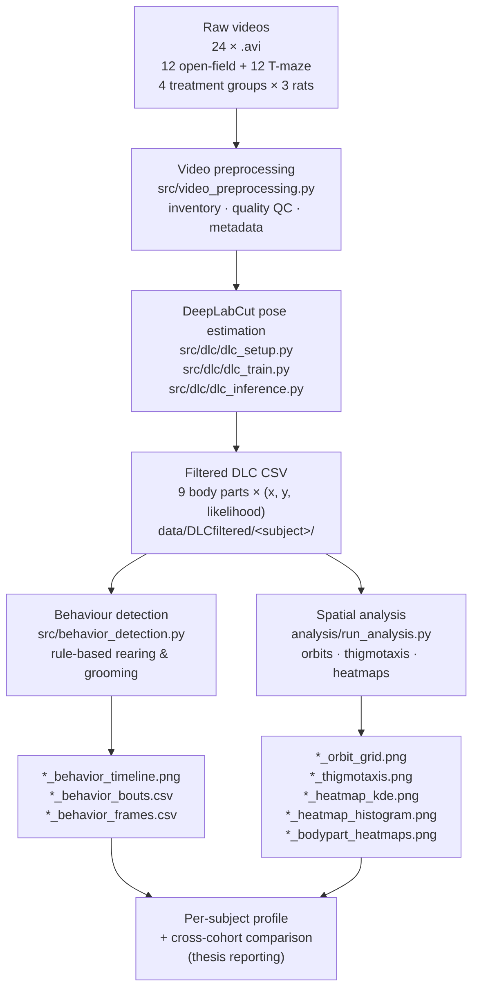
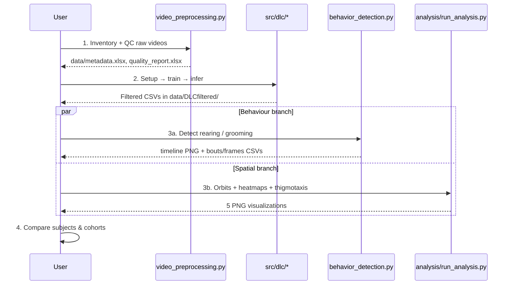
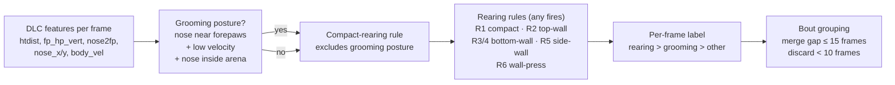

# Rat Behavioral Analysis System

End-to-end pipeline for quantifying rat behaviour in open-field and T-maze
recordings using **DeepLabCut** pose estimation, rule-based behaviour
detection, and spatial-occupancy analysis.

This repository accompanies a thesis on per-subject and per-cohort
behavioural profiling (MA1 / MA3 / MA5 / MA7).

> **Looking for a description of what the pipeline produces?**
> See [`OUTPUTS.md`](OUTPUTS.md) — a full walkthrough of every file that
> lands in `data/DLCfiltered/<subject>/`.

---

## Dataset & experimental design

We ask a single question: **how do common dietary additives change rat
behaviour in open-field and T-maze assays?** Twelve rats are split into four
treatment groups of three, and each rat is recorded in both arenas — giving
12 open-field videos and 12 T-maze videos (**24 `.avi` recordings** total).

### Treatment groups

| Cohort | Rats      | Treatment                 | Role                     |
|--------|-----------|---------------------------|--------------------------|
| MA1    | MA1_1–3   | none (vehicle)            | **control baseline**     |
| MA3    | MA3_1–3   | aspartame                 | sweetener arm            |
| MA5    | MA5_1–3   | grapefruit only           | grapefruit-only arm        |
| MA7    | MA7_1–3   | aspartame + grapefruit    | combined / interaction arm |

The grapefruit arm lets us separate a grapefruit-only effect from the
aspartame + grapefruit combination, and compare both against the aspartame
and control arms.

### Recordings

| Arena          | Videos | Purpose                                          |
|----------------|--------|--------------------------------------------------|
| Open field     | 12     | Exploration, anxiety, locomotion, rearing, grooming |
| T-maze         | 12     | Decision-making, turn bias, path efficiency      |

Each rat contributes one open-field recording and one T-maze recording.
Subjects are named `OpenField<COHORT>_<RUN>` (e.g. `OpenFieldMA5_2`) and
`TMaze<COHORT>_<RUN>`. All recordings are at **30 fps**; frame `f`
corresponds to time `f / 30` s.

---

## Pipeline overview



### Execution sequence



---

## Example outputs

All screenshots below are from `OpenFieldMA1_2`. Every subject in
`data/DLCfiltered/` has the same set of files — see [`OUTPUTS.md`](OUTPUTS.md)
for the full per-file breakdown.

### Behaviour timeline

Rule-based detection of rearing (red) and grooming (green) vs. manually
validated ground truth. Three rows: ground truth, detected bouts, per-frame
labels.


### Spatial occupancy (KDE)

Kernel-density estimate of the body-centre over the session. Hot spots
reveal wall-hugging (thigmotaxis) vs. centre exploration.


### Thigmotaxis trajectory

Body-centre trajectory with the inner zone drawn at 20% margin. Used to
compute the % of time spent away from the walls — a classic anxiety-like
index in open-field assays.


### Per-bodypart orbit grid

One trajectory panel per tracked body part — useful both qualitatively
(exploration pattern) and as a tracking-quality check.


---

## Repository layout

```
RatBehaviorAnalyze/
├── README.md                          ← this file
├── OUTPUTS.md                         ← guide to every output file
│
├── src/                               Main pipeline code
│   ├── behavior_detection.py          Rule-based rearing/grooming detector
│   ├── video_preprocessing.py         Stage 01: inventory, QC, metadata
│   ├── orbit_plot.py                  Trajectory plotting
│   ├── show_frame_coords.py           Arena-boundary picker (interactive)
│   ├── requirements.txt
│   └── dlc/                           DeepLabCut wrappers
│       ├── dlc_setup.py               Create project, extract & label frames
│       ├── dlc_train.py               Train and evaluate the DLC model
│       └── dlc_inference.py           Run inference, export filtered CSVs
│
├── analysis/                          Spatial / locomotion analysis
│   ├── run_analysis.py                One-shot runner for all 4 outputs
│   ├── show_frame_coords.py           Interactive arena selector
│   ├── orbit_plot.py                  Per-bodypart trajectories
│   ├── activity_heatmap.py            Body-centre KDE + histogram
│   ├── bodypart_heatmaps.py           Per-bodypart density grid
│   ├── README.md                      Tool-level docs
│   └── WORKFLOW_SUMMARY.md            Filtering pipeline & parameters
│
├── tools/
│   └── convert_labeled_to_video_format.py
│
├── data/
│   ├── DLCfiltered/                   One folder per subject (inputs + outputs)
│   │   └── OpenField<COHORT>_<RUN>/
│   │       ├── OpenField<...>.csv              ← DLC-filtered input
│   │       ├── *_behavior_timeline.png         ← behaviour detection
│   │       ├── *_behavior_bouts.csv
│   │       ├── *_behavior_frames.csv
│   │       ├── *_orbit_grid.png                ← spatial analysis
│   │       ├── *_thigmotaxis.png
│   │       ├── *_heatmap_kde.png
│   │       ├── *_heatmap_histogram.png
│   │       └── *_bodypart_heatmaps.png
│   ├── metadata.xlsx                  Per-video metadata
│   ├── part0_oft_metrics.xlsx         Cross-subject OFT summary
│   ├── part0_trajectories/            Quick-look trajectory PNGs
│   ├── quality_plots/                 Per-video brightness plots
│   └── quality_report.xlsx            QC summary
│
├── documents/
│   ├── DEEPLABCUT_PIPELINE.md         DLC workflow (10 stages)
│   ├── RAT_TMAZE_PROJECT.md           Project roadmap and research questions
│   ├── behavior_detection_documentation.md   Detector design (Turkish)
│   └── plans/                         Per-stage design docs (STAGE_01 … STAGE_07)
│
└── docs/
    └── behavior_detection_documentation.md   (mirror)
```

---

## Setup

```bash
conda create -n dlc python=3.10 -y
conda activate dlc
pip install -r src/requirements.txt
```

Requires CUDA 11.8 or 12.1 with an NVIDIA GPU for DLC training (tested on
RTX 3060 6 GB). Behaviour detection and spatial analysis run on CPU.

---

## Quickstart — analyse one subject end-to-end

Assuming a DLC-filtered CSV is already in place at
`data/DLCfiltered/OpenFieldMA5_2/OpenFieldMA5_2.csv`:

```bash
# 1. Detect rearing & grooming
python src/behavior_detection.py \
    --csv data/DLCfiltered/OpenFieldMA5_2/OpenFieldMA5_2.csv

# 2. Pick arena boundaries interactively (first subject only)
python analysis/show_frame_coords.py \
    --video data/DLCfiltered/OpenFieldMA5_2.mp4

# 3. Generate all 4 spatial visualizations in one shot
python analysis/run_analysis.py --arena 396 776 153 530
```

All outputs land next to the input CSV.

---

## Full pipeline stages

| Stage | Script / folder                          | What it does |
|-------|------------------------------------------|--------------|
| 01    | `src/video_preprocessing.py`             | Video inventory, QC (brightness, FPS), metadata export |
| 02    | `src/dlc/dlc_setup.py`                   | Create DLC project, extract frames, launch labelling GUI |
| 02    | `src/dlc/dlc_train.py`                   | Train and evaluate the DLC model |
| 02    | `src/dlc/dlc_inference.py`               | Run inference, export filtered tracking CSVs |
| 02B   | `src/behavior_detection.py`              | Rule-based rearing / grooming classifier |
| 03A   | `analysis/run_analysis.py`               | Orbits, thigmotaxis, KDE & per-bodypart heatmaps (OFT) |
| 03B   | (planned)                                | T-maze heatmaps & zone dwell — see `documents/plans/STAGE_03B_TMAZE_HEATMAPS.md` |
| 04    | (planned)                                | Path analysis — `STAGE_04_PATH_ANALYSIS.md` |
| 05    | (planned)                                | Feature engineering — `STAGE_05_FEATURE_ENGINEERING.md` |
| 06    | (planned)                                | ML model training — `STAGE_06_MODEL_TRAINING.md` |
| 07    | (planned)                                | Cross-cohort reporting — `STAGE_07_REPORTING.md` |

Design docs for each stage live in `documents/plans/`.

---

## Behaviour detection (stage 02B)

Rule-based detector in `src/behavior_detection.py`. No ML training needed —
thresholds on postural features separate behaviours.



Full rationale (thresholds, failure modes, ground-truth validation) in
[`documents/behavior_detection_documentation.md`](documents/behavior_detection_documentation.md).

### Ground-truth validation

Hand-labelled windows for a subset of subjects are stored in
`GROUND_TRUTH_BY_SUBJECT` in `src/behavior_detection.py` and rendered as
the top row of the timeline plot. Current coverage:

| Subject       | Rearing GT | Grooming GT |
|---------------|------------|-------------|
| OpenFieldMA1_2 | 9 windows  | 2 windows   |
| OpenFieldMA5_1 | —          | 5 windows   |
| all others    | not yet entered | not yet entered |

---

## Behavioural metrics (per arena)

### Open field (rectangle)

| Metric | Psychological relevance |
|--------|------------------------|
| Rearing bouts & total rearing time | Exploration / vigilance |
| Grooming bouts & total grooming time | Stress recovery / displacement |
| Thigmotaxis (% time in inner zone) | Anxiety-like behaviour |
| Total distance travelled | Locomotor activity |
| Mean velocity | Arousal / inhibition |
| Spatial KDE hot-spot count | Exploration pattern |

### T-maze (planned — Part1/Part2)

| Metric | Psychological relevance |
|--------|------------------------|
| Turn bias (L/R ratio) | Lateralization, perseveration |
| Decision latency | Anxiety, deliberation |
| Path efficiency | Cognitive load |
| Zone dwell time | Preference / avoidance |
| Backtrack rate | Memory deficit, uncertainty |

---

## Technology stack

| Component | Tool |
|-----------|------|
| Pose estimation    | DeepLabCut (PyTorch backend) |
| Video processing   | OpenCV |
| Data processing    | Pandas, NumPy, SciPy |
| Visualization      | Matplotlib, Seaborn |
| ML models (planned)| Scikit-learn, XGBoost, PyTorch |
| Notebooks          | Jupyter Lab |

---

## Documentation index

- [`OUTPUTS.md`](OUTPUTS.md) — what every file in `data/DLCfiltered/<subject>/` means and how to read it
- [`analysis/README.md`](analysis/README.md) — spatial-analysis tools (quickstart + parameters)
- [`analysis/WORKFLOW_SUMMARY.md`](analysis/WORKFLOW_SUMMARY.md) — filtering pipeline details
- [`documents/DEEPLABCUT_PIPELINE.md`](documents/DEEPLABCUT_PIPELINE.md) — full DLC workflow (10 stages)
- [`documents/RAT_TMAZE_PROJECT.md`](documents/RAT_TMAZE_PROJECT.md) — project roadmap and research questions
- [`documents/behavior_detection_documentation.md`](documents/behavior_detection_documentation.md) — behaviour-detector design rationale (Turkish)
- [`documents/plans/`](documents/plans/) — per-stage design documents

---

## Project status

| Stage | Status |
|-------|--------|
| 01 — Video preprocessing / QC                  | done |
| 02 — DeepLabCut pose estimation                | done |
| 02B — Rule-based behaviour detection           | done, validated on MA1_2 / MA5_1 |
| 03A — Open-field spatial analysis              | done for MA1 / MA3 / MA5 cohorts |
| 03A — Spatial analysis for MA7 cohort          | pending |
| 03B — T-maze heatmaps                          | planned |
| 04 — Path analysis                             | planned |
| 05 — Feature engineering                       | planned |
| 06 — ML classifier (psychological states)      | planned |
| 07 — Cross-cohort reporting                    | planned |
