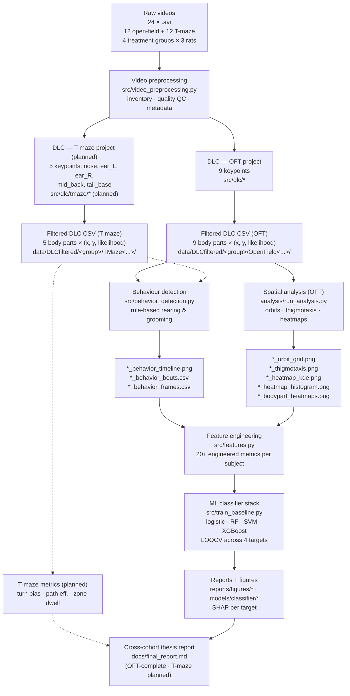
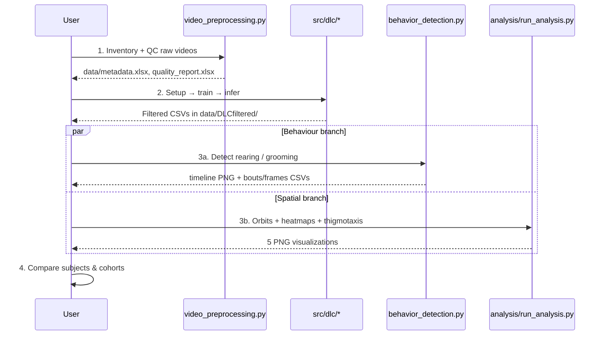
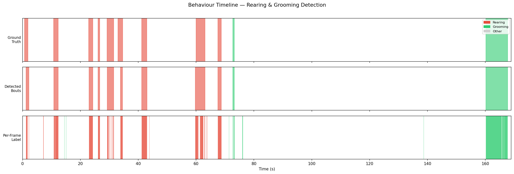
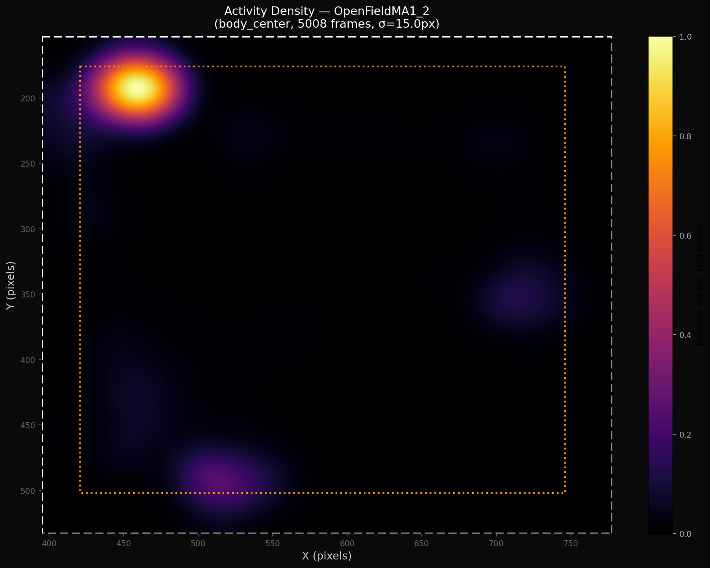
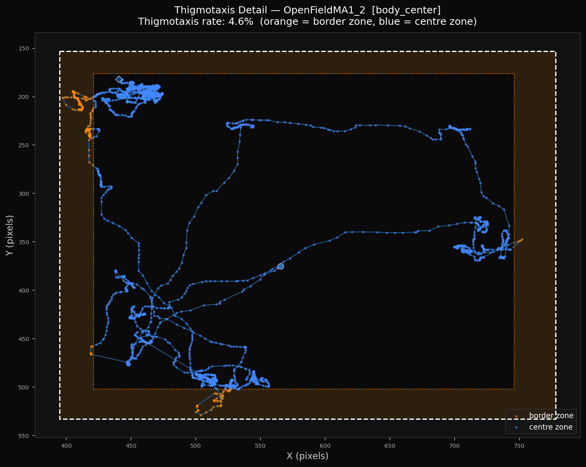
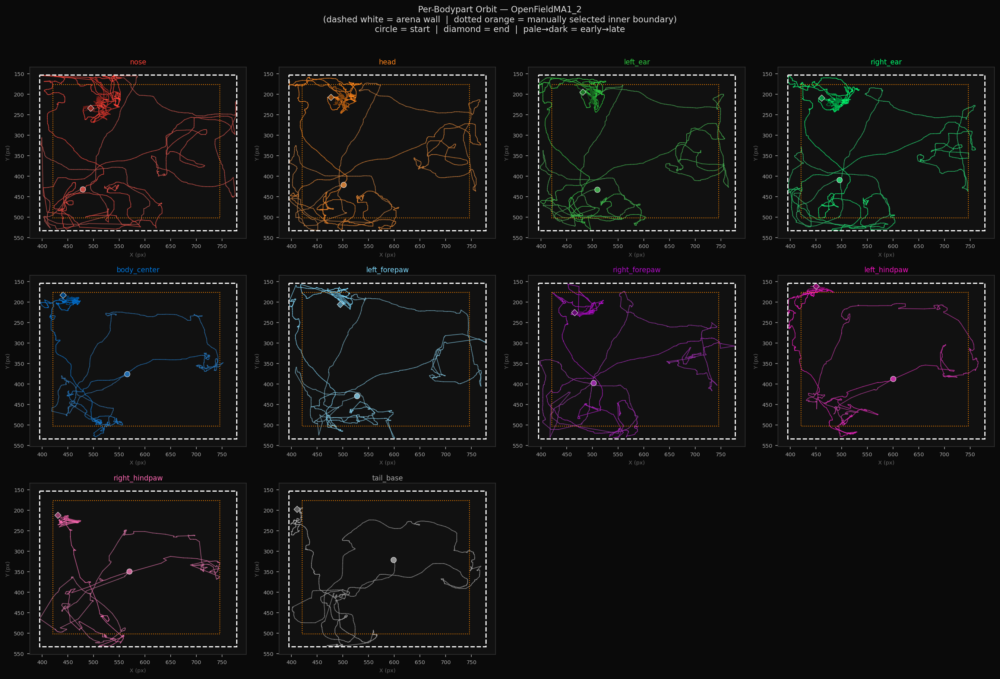
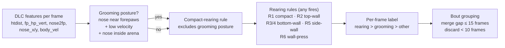

# Rat Behavioral Analysis System

End-to-end pipeline for quantifying rat behaviour in open-field and T-maze
recordings using **DeepLabCut** pose estimation, rule-based behaviour
detection, spatial-occupancy analysis, and a downstream ML classifier
stack (LOOCV + SHAP).

This repository accompanies a thesis on per-subject and per-cohort
behavioural profiling (MA1 / MA3 / MA5 / MA7).

### Current state (2026-05-05)

- **Open-field arm:** end-to-end pipeline complete. 12 subjects (4 cohorts × 3 rats)
  processed through DLC → behaviour detection → spatial analysis → feature
  engineering → LOOCV-validated ML classifiers (logistic / RF / SVM / XGBoost
  across 4 targets) → SHAP interpretation. See [`docs/final_report.md`](docs/final_report.md).
- **T-maze arm:** reactivated 2026-05-05 after a brief deferral. Now in
  planning: a **separate, lighter 5-point DLC model** (vs. the OFT 9-point
  set) — small subjects, corridor wall occlusion, and top-down-only camera
  made the OFT model unsuitable. Keypoint set, per-behaviour metric mapping,
  and repo layout decisions live in
  [`docs/tmaze_keypoints_and_layout.md`](docs/tmaze_keypoints_and_layout.md).
- **Cohort statistics (replaces failed cohort classifier):**
  Kruskal-Wallis + Dunn post-hoc + PERMANOVA pipeline at
  `analysis/cohort_stats.py` — main result: `center_zone_entries` shows a
  large effect (ε²=0.69) with Grapefruit < ASP+GF (Dunn z=2.85, within-feature
  q=0.026); other anxiety-axis features point the same direction but don't
  survive BH-FDR. Outputs in `reports/cohort_*.csv`.
- **Next planned model — window-level behaviour classifier:** the
  subject-level ML stack hit n=12 limits (cohort F1≈0.27, label leakage on
  anxiety_level). Plan now is to train at the **window level** (1-second
  pose slices, ~50k samples, subject-grouped LOSO) to replace the rule-based
  detector with a retrainable model that ports cleanly to T-maze. Full
  7-phase plan in
  [`docs/window_classifier_plan.md`](docs/window_classifier_plan.md).

> **Looking for a description of what the pipeline produces?**
> See [`OUTPUTS.md`](OUTPUTS.md) — a full walkthrough of every file that
> lands in `data/DLCfiltered/<subject>/`.

---

## Dataset & experimental design

We ask a single question: **how do common dietary additives change rat
behaviour in open-field and T-maze assays?** Twelve rats are split into four
treatment groups of three, and each rat is recorded in both arenas — giving
12 open-field videos and 12 T-maze videos (**24 `.avi` recordings** total).

### Treatment groups

| Cohort | Rats      | Treatment                 | Role                     |
|--------|-----------|---------------------------|--------------------------|
| MA1    | MA1_1–3   | none (vehicle)            | **control baseline**     |
| MA3    | MA3_1–3   | aspartame                 | sweetener arm            |
| MA5    | MA5_1–3   | grapefruit only           | grapefruit-only arm        |
| MA7    | MA7_1–3   | aspartame + grapefruit    | combined / interaction arm |

The grapefruit arm lets us separate a grapefruit-only effect from the
aspartame + grapefruit combination, and compare both against the aspartame
and control arms.

### Recordings

| Arena          | Videos | Purpose                                          |
|----------------|--------|--------------------------------------------------|
| Open field     | 12     | Exploration, anxiety, locomotion, rearing, grooming |
| T-maze         | 12     | Decision-making, turn bias, path efficiency      |

Each rat contributes one open-field recording and one T-maze recording.
Subjects are named `OpenField<COHORT>_<RUN>` (e.g. `OpenFieldMA5_2`) and
`TMaze<COHORT>_<RUN>`. All recordings are at **30 fps**; frame `f`
corresponds to time `f / 30` s.

---

## Pipeline overview



### Execution sequence



---

## Example outputs

All screenshots below are from `OpenFieldMA1_2`. Every subject in
`data/DLCfiltered/` has the same set of files — see [`OUTPUTS.md`](OUTPUTS.md)
for the full per-file breakdown.

### Behaviour timeline

Rule-based detection of rearing (red) and grooming (green) vs. manually
validated ground truth. Three rows: ground truth, detected bouts, per-frame
labels.



### Spatial occupancy (KDE)

Kernel-density estimate of the body-centre over the session. Hot spots
reveal wall-hugging (thigmotaxis) vs. centre exploration.



### Thigmotaxis trajectory

Body-centre trajectory with the inner zone drawn at 20% margin. Used to
compute the % of time spent away from the walls — a classic anxiety-like
index in open-field assays.



### Per-bodypart orbit grid

One trajectory panel per tracked body part — useful both qualitatively
(exploration pattern) and as a tracking-quality check.



---

## Repository layout

```
RatBehaviorAnalyze/
├── README.md                          ← this file
├── OUTPUTS.md                         ← guide to every output file
│
├── src/                               Main pipeline code
│   ├── behavior_detection.py          Rule-based rearing/grooming detector
│   ├── video_preprocessing.py         Stage 01: inventory, QC, metadata
│   ├── features.py                    Stage 05: feature engineering (20+ metrics/subject)
│   ├── train_baseline.py              Stage 06: LOOCV across 4 targets, 4 model families
│   ├── visualize_reports.py           Stage 07: confusion matrices, SHAP, OvR F1
│   ├── window_features.py             (planned) Stage 06.2: pose-window feature extractor
│   ├── window_labeling.py             (planned) Stage 06.2: bind ground-truth to windows
│   ├── train_window_classifier.py     (planned) Stage 06.2: subject-grouped LOSO trainer
│   ├── inference.py                   (planned) Stage 06.2: CSV-in → bouts + metrics
│   ├── orbit_plot.py                  Trajectory plotting
│   ├── show_frame_coords.py           Arena-boundary picker (interactive)
│   ├── requirements.txt
│   ├── dlc/                           DeepLabCut wrappers (OFT, 9 keypoints)
│   │   ├── dlc_setup.py               Create project, extract & label frames
│   │   ├── dlc_train.py               Train and evaluate the DLC model
│   │   └── dlc_inference.py           Run inference, export filtered CSVs
│   ├── dlc/tmaze/                     (planned) T-maze DLC project, 5 keypoints
│   └── tmaze/                         (planned) arena geometry, metrics, zone classifier
│
├── analysis/                          Spatial / locomotion analysis
│   ├── run_analysis.py                One-shot runner for all 4 OFT outputs
│   ├── oft_metrics.py                 Per-subject OFT metric extraction
│   ├── speed_analysis.py              Speed pipeline + cohort summary
│   ├── kutu_validation.py             Cross-validation vs. professor's HSV-blob pipeline
│   ├── behavior_analysis.py           Aggregated behaviour bouts → group stats
│   ├── cohort_stats.py                Kruskal-Wallis + Dunn + PERMANOVA across cohorts
│   ├── label_bouts.py                 (planned) Interactive bout-labelling tool
│   ├── orbit_plot.py                  Per-bodypart trajectories
│   ├── activity_heatmap.py            Body-centre KDE + histogram
│   ├── bodypart_heatmaps.py           Per-bodypart density grid
│   ├── README.md                      Tool-level docs
│   └── WORKFLOW_SUMMARY.md            Filtering pipeline & parameters
│
├── tools/
│   └── convert_labeled_to_video_format.py
│
├── data/
│   ├── DLCfiltered/                   One folder per cohort/subject (inputs + outputs)
│   │   ├── control/                   MA1 cohort
│   │   │   └── OpenFieldMA1_<RUN>/    ← see OUTPUTS.md for the per-subject file set
│   │   ├── ASP/                       MA3 cohort
│   │   ├── Greyfurt/                  MA5 cohort
│   │   ├── ASP ve Greyfurt/           MA7 cohort
│   │   └── Kare/                      Professor's _res.mat reference (Kutu_v1, OFT only)
│   ├── (planned) TMaze<COHORT>_<RUN>/ subject folders inside each cohort dir
│   ├── metadata.xlsx                  Per-video metadata
│   ├── oft_metrics_all.csv            Cross-subject OFT metric table
│   ├── behavior_summary.csv           Cross-subject rearing/grooming summary
│   ├── kutu_validation_summary.csv    DLC vs. HSV-blob speed cross-check
│   ├── speed_summary_all.csv          Mean/instantaneous speed per subject
│   ├── part0_oft_metrics.xlsx         Cross-subject OFT summary (legacy)
│   ├── part0_trajectories/            Quick-look trajectory PNGs
│   ├── quality_plots/                 Per-video brightness plots
│   └── quality_report.xlsx            QC summary
│
├── models/
│   └── classifier/                    Trained pickles (4 models × 4 targets) + scaler
│
├── reports/
│   ├── loocv_predictions.csv          Per-fold per-target predictions
│   ├── model_comparison.csv           Per-model accuracy / F1 across targets
│   ├── ovr_binary_f1.csv              One-vs-rest F1 per cohort
│   ├── cohort_kruskal_wallis.csv      Per-feature KW (H, p_perm, ε², q_bh)
│   ├── cohort_dunn_posthoc.csv        Pairwise Dunn z + p (within-feature BH)
│   ├── cohort_permanova.csv           Multivariate pseudo-F + R² + p_perm
│   └── figures/                       SHAP + confusion-matrix PNGs (per target)
│
├── docs/
│   ├── final_report.md                OFT-complete thesis chapter + inference roadmap
│   ├── tmaze_keypoints_and_layout.md  T-maze keypoint plan + repo layout (NEW, 2026-05-05)
│   ├── behavior_detection_documentation.md   Detector design (algorithmic)
│   ├── behavior_comparison.md         Cohort-vs-cohort behavioural comparison
│   └── yapilanlar.md                  Running progress log (Turkish)
│
└── documents/                         Older planning docs — superseded in places
    ├── DEEPLABCUT_PIPELINE.md         DLC workflow (10 stages)
    ├── RAT_TMAZE_PROJECT.md           Earlier roadmap (assumed single shared DLC model;
    │                                   superseded by docs/tmaze_keypoints_and_layout.md)
    ├── behavior_detection_documentation.md   Detector design (Turkish narrative)
    └── plans/                         Per-stage design docs (STAGE_01 … STAGE_07)
```

---

## Setup

```bash
conda create -n dlc python=3.10 -y
conda activate dlc
pip install -r src/requirements.txt
```

Requires CUDA 11.8 or 12.1 with an NVIDIA GPU for DLC training (tested on
RTX 3060 6 GB). Behaviour detection and spatial analysis run on CPU.

---

## Quickstart — analyse one subject end-to-end

Assuming a DLC-filtered CSV is already in place at
`data/DLCfiltered/OpenFieldMA5_2/OpenFieldMA5_2.csv`:

```bash
# 1. Detect rearing & grooming
python src/behavior_detection.py \
    --csv data/DLCfiltered/OpenFieldMA5_2/OpenFieldMA5_2.csv

# 2. Pick arena boundaries interactively (first subject only)
python analysis/show_frame_coords.py \
    --video data/DLCfiltered/OpenFieldMA5_2.mp4

# 3. Generate all 4 spatial visualizations in one shot
python analysis/run_analysis.py --arena 396 776 153 530
```

All outputs land next to the input CSV.

---

## Full pipeline stages

| Stage | Script / folder                          | What it does | Status |
|-------|------------------------------------------|--------------|--------|
| 01    | `src/video_preprocessing.py`             | Video inventory, QC (brightness, FPS), metadata export | done |
| 02    | `src/dlc/dlc_setup.py`                   | Create DLC project (OFT, 9 keypoints), extract frames, launch labelling GUI | done |
| 02    | `src/dlc/dlc_train.py`                   | Train and evaluate the OFT DLC model | done |
| 02    | `src/dlc/dlc_inference.py`               | Run inference, export filtered tracking CSVs | done |
| 02B   | `src/behavior_detection.py`              | Rule-based rearing / grooming classifier (OFT) | done |
| 03A   | `analysis/run_analysis.py`               | Orbits, thigmotaxis, KDE & per-bodypart heatmaps (OFT) | done |
| 03A.1 | `analysis/speed_analysis.py`             | Speed pipeline + cohort summary | done |
| 03A.2 | `analysis/kutu_validation.py`            | Cross-validation vs. professor's 2017 HSV-blob MATLAB pipeline | done |
| 05    | `src/features.py`                        | Feature engineering — 20+ metrics per subject | done |
| 06    | `src/train_baseline.py`                  | LOOCV training — logistic / RF / SVM / XGBoost across 4 targets | done |
| 07    | `src/visualize_reports.py` + `docs/final_report.md` | Confusion matrices, SHAP, OvR F1, written report | done |
| 06.1  | `analysis/cohort_stats.py`               | Non-parametric cohort effect — Kruskal-Wallis + Dunn + PERMANOVA (replaces failed cohort classifier) | done |
| 06.2  | `docs/window_classifier_plan.md`         | Window-level behaviour classifier — 7-phase plan (replaces rule-based detector at inference time) | planned |
| —     | `docs/tmaze_keypoints_and_layout.md`     | T-maze keypoint plan + repo layout (5-point DLC project, separate from OFT) | planned |
| 02-T  | `src/dlc/tmaze/*` (planned)              | T-maze DLC project — separate model, 5 keypoints | planned |
| 02B-T | `src/behavior_detection.py` (refactor)   | Make detector keypoint-profile aware so the same code serves both arenas | planned |
| 03B   | `src/tmaze/tmaze_metrics.py` (planned)   | Turn bias, path efficiency, zone dwell, decision latency | planned |
| 04    | `analysis/tmaze_path_plot.py` (planned)  | Path overlay + zone heatmap | planned |

Design docs for each stage live in `documents/plans/`. T-maze keypoint and
layout decisions are consolidated in
[`docs/tmaze_keypoints_and_layout.md`](docs/tmaze_keypoints_and_layout.md).

---

## Behaviour detection (stage 02B)

Rule-based detector in `src/behavior_detection.py`. No ML training needed —
thresholds on postural features separate behaviours.



Full rationale (thresholds, failure modes, ground-truth validation) in
[`documents/behavior_detection_documentation.md`](documents/behavior_detection_documentation.md).

### Ground-truth validation

Hand-labelled windows for a subset of subjects are stored in
`GROUND_TRUTH_BY_SUBJECT` in `src/behavior_detection.py` and rendered as
the top row of the timeline plot. Current coverage:

| Subject       | Rearing GT | Grooming GT |
|---------------|------------|-------------|
| OpenFieldMA1_2 | 9 windows  | 2 windows   |
| OpenFieldMA5_1 | —          | 5 windows   |
| all others    | not yet entered | not yet entered |

---

## Behavioural metrics (per arena)

### Open field (rectangle)

| Metric | Psychological relevance |
|--------|------------------------|
| Rearing bouts & total rearing time | Exploration / vigilance |
| Grooming bouts & total grooming time | Stress recovery / displacement |
| Thigmotaxis (% time in inner zone) | Anxiety-like behaviour |
| Total distance travelled | Locomotor activity |
| Mean velocity | Arousal / inhibition |
| Spatial KDE hot-spot count | Exploration pattern |

### T-maze (planned — separate 5-point DLC project)

DLC keypoints: `nose, ear_L, ear_R, mid_back, tail_base`. Front paws and
hip/shoulder are excluded — top-down camera + small subjects + corridor
wall occlusion make them more noise than signal. Full rationale and
per-behaviour metric mapping in
[`docs/tmaze_keypoints_and_layout.md`](docs/tmaze_keypoints_and_layout.md).

| Metric | Psychological relevance | Keypoints used |
|--------|------------------------|----------------|
| Turn bias (L/R ratio) | Lateralization, perseveration | `nose`, `mid_back`, `tail_base` |
| Decision latency | Anxiety, deliberation | `mid_back`, `tail_base` |
| Path efficiency | Cognitive load | `mid_back`, `tail_base` |
| Zone dwell time | Preference / avoidance | `mid_back` |
| Backtrack rate | Memory deficit, uncertainty | `(nose − mid_back)` heading |
| Rearing (top-down) | Exploration / vigilance | `nose`, `mid_back`, `tail_base` |
| Grooming (top-down) | Stress recovery / displacement | `nose`, `ear_L`, `ear_R`, `mid_back` |

---

## Technology stack

| Component | Tool |
|-----------|------|
| Pose estimation    | DeepLabCut (PyTorch backend) |
| Video processing   | OpenCV |
| Data processing    | Pandas, NumPy, SciPy |
| Visualization      | Matplotlib, Seaborn |
| ML models (planned)| Scikit-learn, XGBoost, PyTorch |
| Notebooks          | Jupyter Lab |

---

## Documentation index

- [`OUTPUTS.md`](OUTPUTS.md) — what every file in `data/DLCfiltered/<subject>/` means and how to read it
- [`docs/final_report.md`](docs/final_report.md) — **consolidated OFT thesis chapter + ML inference roadmap**
- [`docs/tmaze_keypoints_and_layout.md`](docs/tmaze_keypoints_and_layout.md) — **T-maze keypoint plan + repo layout (5-point DLC project)**
- [`docs/window_classifier_plan.md`](docs/window_classifier_plan.md) — **window-level behaviour classifier — 7-phase implementation plan**
- [`docs/behavior_detection_documentation.md`](docs/behavior_detection_documentation.md) — behaviour-detector design (algorithmic)
- [`docs/behavior_comparison.md`](docs/behavior_comparison.md) — cohort-vs-cohort behavioural comparison
- [`docs/yapilanlar.md`](docs/yapilanlar.md) — running progress log (Turkish)
- [`analysis/README.md`](analysis/README.md) — spatial-analysis tools (quickstart + parameters)
- [`analysis/WORKFLOW_SUMMARY.md`](analysis/WORKFLOW_SUMMARY.md) — filtering pipeline details
- [`documents/DEEPLABCUT_PIPELINE.md`](documents/DEEPLABCUT_PIPELINE.md) — full DLC workflow (10 stages)
- [`documents/RAT_TMAZE_PROJECT.md`](documents/RAT_TMAZE_PROJECT.md) — earlier roadmap (single-DLC-model assumption superseded by `docs/tmaze_keypoints_and_layout.md`)
- [`documents/behavior_detection_documentation.md`](documents/behavior_detection_documentation.md) — behaviour-detector design rationale (Turkish)
- [`documents/plans/`](documents/plans/) — per-stage design documents

---

## Project status

### Open-field arm

| Stage | Status |
|-------|--------|
| 01 — Video preprocessing / QC                                    | done |
| 02 — DeepLabCut pose estimation (9-keypoint OFT model)           | done |
| 02B — Rule-based behaviour detection (rearing / grooming)        | done, validated on MA1_2 / MA5_1 |
| 03A — Spatial analysis (orbits, thigmotaxis, KDE, per-bodypart)  | done for MA1 / MA3 / MA5 / MA7 |
| 03A.1 — Speed pipeline + cohort summary                          | done |
| 03A.2 — Cross-validation vs. professor's HSV-blob pipeline       | done (~14% mean-speed bias, uniform across cohorts) |
| 05 — Feature engineering (20+ metrics per subject)               | done |
| 06 — ML classifier (LOOCV, 4 model families × 4 targets, SHAP)   | done (label-leakage caveat — see final_report) |
| 06.1 — Cohort statistics (`analysis/cohort_stats.py`, KW + Dunn + PERMANOVA) | done — `center_zone_entries` survives within-feature FDR |
| 06.2 — Window-level behaviour classifier (`docs/window_classifier_plan.md`) | **planning (2026-05-05)** — 7 phases, replaces rule-based detector |
| 07 — Cross-cohort reporting (`docs/final_report.md`)             | done |

### T-maze arm

| Stage | Status |
|-------|--------|
| Keypoint plan + file-layout decision (`docs/tmaze_keypoints_and_layout.md`) | **done (2026-05-05)** |
| 02-T — DLC project setup (5 keypoints, separate from OFT)        | planned |
| 02-T — DLC labelling + training                                  | planned |
| 02B-T — Behaviour detection refactor (keypoint-profile aware)    | planned |
| 03B — T-maze metrics: turn bias, path efficiency, zone dwell, decision latency | planned |
| 04 — Path overlay + zone heatmap                                 | planned |
| Integration into `docs/final_report.md` (T-maze chapter)         | planned |
