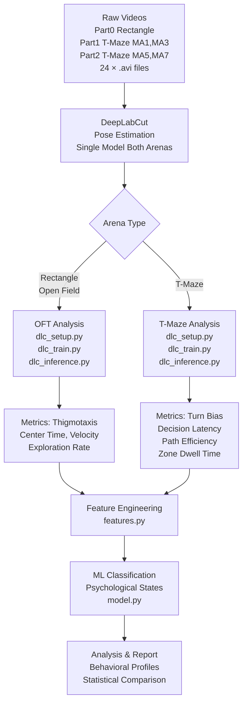
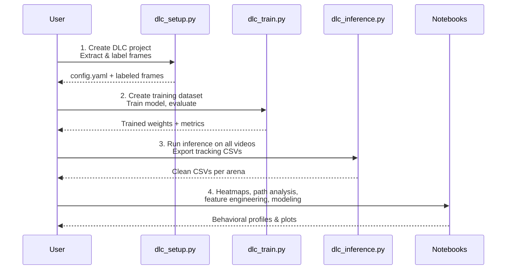

# Rat Behavioral Analysis System

End-to-end pipeline for rat behavioral analysis using DeepLabCut pose estimation and machine learning.

---

## Dataset

| Part | Arena | Rats | Sessions | Videos |
|------|-------|------|----------|--------|
| Part0 | Rectangle (Open Field) | MA1, MA3, MA5, MA7 | 3 each | 12 |
| Part1 | T-Maze | MA1, MA3 | 3 each | 6 |
| Part2 | T-Maze | MA5, MA7 | 3 each | 6 |

**Total: 24 videos, 4 rats, `.avi` format**

---

## Pipeline



### Execution Stages



---

## Project Structure

```
ThesisWork/
├── data/
│   ├── raw_videos/
│   │   ├── Part0/          # Rectangle arena (.avi)
│   │   ├── Part1/          # T-maze MA1, MA3 (.avi)
│   │   └── Part2/          # T-maze MA5, MA7 (.avi)
│   ├── dlc_output/
│   │   ├── rectangle/      # Tracking CSVs for open field videos
│   │   ├── tmaze/          # Tracking CSVs for T-maze videos
│   │   ├── clean/          # Cleaned, flat CSVs ready for analysis
│   │   └── labeled_videos/ # QC annotated videos
│   ├── heatmaps/
│   └── features/
├── models/
│   ├── dlc_model/          # Trained DeepLabCut project
│   └── classifier/         # Trained psychological state models
├── notebooks/
│   ├── 01_dlc_analysis.ipynb
│   ├── 02_heatmap_generation.ipynb
│   ├── 03_path_analysis.ipynb
│   ├── 04_feature_engineering.ipynb
│   └── 05_model_training.ipynb
├── src/
│   ├── dlc_setup.py        # Stage 1-2: Create DLC project, extract & label frames
│   ├── dlc_train.py        # Stage 3-4: Train and evaluate DLC model
│   ├── dlc_inference.py    # Stage 5: Run inference, export clean tracking CSVs
│   ├── heatmap.py          # Stage 6: Spatial occupancy heatmaps
│   ├── path_analysis.py    # Stage 7: Trajectory and zone metrics
│   ├── features.py         # Stage 8: Feature dataset construction
│   ├── model.py            # Stage 9: ML model training and evaluation
│   └── requirements.txt
├── documents/
│   ├── DEEPLABCUT_PIPELINE.md
│   └── RAT_TMAZE_PROJECT.md
└── README.md
```

---

## Setup

```bash
conda create -n dlc python=3.10 -y
conda activate dlc
pip install -r src/requirements.txt
```

Requires CUDA 11.8 or 12.1 with an NVIDIA GPU (tested on RTX 3060 6GB).

---

## Usage

Run the stages in order:

```bash
# 1. Create DLC project, extract frames, launch labeling GUI
python src/dlc_setup.py

# 2. Train and evaluate the DLC model
python src/dlc_train.py

# 3. Run inference on all videos, export clean CSVs
python src/dlc_inference.py
```

After inference, use the notebooks for analysis.

---

## Behavioral Metrics

### Rectangle Arena (Open Field Test)
| Metric | Psychological Relevance |
|--------|------------------------|
| Center time vs wall time (thigmotaxis) | Anxiety level |
| Total distance traveled | Locomotion / activity |
| Mean velocity | Arousal / inhibition |
| Exploration rate (novel zone entries) | Exploratory drive |

### T-Maze
| Metric | Psychological Relevance |
|--------|------------------------|
| Turn bias (L/R ratio) | Lateralization, perseveration |
| Decision latency | Anxiety, deliberation |
| Path efficiency | Cognitive load |
| Zone dwell time | Preference / avoidance |
| Backtrack rate | Memory deficit, uncertainty |

---

## Technology Stack

| Component | Tool |
|-----------|------|
| Pose estimation | DeepLabCut (PyTorch backend) |
| Video processing | OpenCV |
| Data processing | Pandas, NumPy, SciPy |
| Visualization | Matplotlib, Seaborn |
| ML models | Scikit-learn, XGBoost, PyTorch |
| Notebooks | Jupyter Lab |

---

## Documents

- `documents/DEEPLABCUT_PIPELINE.md` — detailed DLC workflow (all 10 stages)
- `documents/RAT_TMAZE_PROJECT.md` — full project roadmap and research questions
