# Blob-Based vs DLC-Based Behavior Detection — Validation Report

> Auto-generated by `analysis/blob_vs_dlc.py`. Re-run to refresh.

**Cohorts compared:** MA1, MA3, MA5, MA7  
**Subjects:** 12 (only animals with both `_res.mat` and DLC `_behavior_frames.csv`)

## Goal

Quantify how well a coarse single-blob detector (HSV-thresholded bounding
box from `sonuc_kutu_final_v1.m`) agrees with the 12-bodypart DLC pose
detector for **rearing** and **grooming**.  If frame-level F1 is high
enough we apply the blob detector to MA2/4/6/8 (which only have
`_res.mat`) and double the rearing/grooming training set.  Otherwise we
drop those targets from the 24-sample classifier.

## Methodology

### Blob features (per frame)

From each `_res.mat` we read `xc, yc, amn, amx, bmn, bmx` and derive:

| Feature | Formula | Purpose |
|---|---|---|
| `blob_w`     | `bmx − bmn`              | horizontal extent (px) |
| `blob_h`     | `amx − amn`              | vertical extent (px) |
| `blob_area`  | `blob_w × blob_h`        | top-down projected area (px²) |
| `aspect`     | `max(w,h) / min(w,h)`    | shape elongation (1 = square) |
| `vel`        | `√(dxc² + dyc²) · fps`   | centroid speed (px/s, smoothed) |

### Detection rules

**Rearing** — when the rat stands vertically the top-down projection
compresses; both `blob_area` shrinks and the bounding box becomes
squarer.  We use a **per-subject locomoting baseline** so the threshold
self-calibrates to lighting / camera-distance differences:

```
baseline = median(blob_area where vel > 60 px/s)
rearing  = (blob_area < 0.55 · baseline) AND (aspect < 1.6)
```

**Grooming** — slow centroid AND stable blob shape AND not rearing:

```
area_cv  = (rolling std / rolling mean) of blob_area, ±15 frames
grooming = (vel < 25 px/s)
           AND (area_cv < 0.18)
           AND NOT rearing
```

Bouts are then merged if separated by ≤ 15 frames
(~0.50 s) and bursts shorter than 10 frames
(~0.33 s) are dropped — same post-processing as
`src/behavior_detection.py`.

### Comparison

- Frame-level confusion matrix over `{other, rearing, grooming}`
- Per-class precision / recall / F1 for rearing and grooming
- Cohen's κ across all three classes (chance-corrected agreement)
- Frame alignment: blob's `t[0]` (s) → DLC frame `round(t[0] · 30)`,
  arrays truncated to common length
- DLC labels are the **reference** (validated against video ground truth
  on MA1_2 / MA5_1 / MA7_1).  F1 here is _agreement_, not absolute accuracy.

**Decision thresholds**

| Mean F1 (both classes) | Action |
|---|---|
| ≥ 0.65 (both) | apply blob detector to MA2/4/6/8 → 24-sample classifier |
| ≥ 0.65 (one only) | hybrid — blob for that class, drop the other |
| < 0.65 (both) | fall back to Strategy A — drop rearing/grooming targets |

F1 ≥ 0.65 was chosen because it corresponds to "substantial" agreement
on Cohen's κ (0.61–0.80, Landis & Koch 1977) — defensible as a label
source for downstream classification.

## Population summary

Mean Cohen's κ across 12 subjects: **0.092** (std 0.048)

| Class | Mean F1 | Std | Min | Max |
|---|---|---|---|---|
| rearing  | 0.127  | 0.157  | 0.000  | 0.594  |
| grooming | 0.253 | 0.143 | 0.063 | 0.582 |

**Verdict:** ❌ **Neither class passes F1 ≥ 0.65** — fall back to Strategy A: drop rearing & grooming targets, train anxiety_level + group on 24 samples × ~11 centroid-only features.

## Per-subject results

| Subject | Frames | κ | Rear P | Rear R | Rear F1 | Rear n_DLC | Groom P | Groom R | Groom F1 | Groom n_DLC |
|---|---|---|---|---|---|---|---|---|---|---|
| MA1_1 | 5036 | 0.020 | 0.87 | 0.45 | 0.59 | 133 | 0.03 | 0.98 | 0.06 | 132 |
| MA1_2 | 5068 | 0.081 | 0.49 | 0.06 | 0.11 | 570 | 0.27 | 0.92 | 0.42 | 1022 |
| MA1_3 | 5082 | 0.074 | 0.30 | 0.15 | 0.20 | 959 | 0.13 | 0.37 | 0.20 | 397 |
| MA3_1 | 5243 | 0.078 | 0.57 | 0.06 | 0.12 | 1189 | 0.09 | 0.82 | 0.15 | 325 |
| MA3_2 | 5041 | 0.043 | 0.37 | 0.10 | 0.16 | 386 | 0.09 | 0.37 | 0.14 | 329 |
| MA3_3 | 4803 | 0.094 | 0.00 | 0.00 | 0.00 | 653 | 0.18 | 0.83 | 0.29 | 591 |
| MA5_1 | 5380 | 0.171 | 0.00 | 0.00 | 0.00 | 460 | 0.42 | 0.93 | 0.58 | 1931 |
| MA5_2 | 5335 | 0.071 | 0.00 | 0.00 | 0.00 | 1287 | 0.20 | 0.46 | 0.28 | 464 |
| MA5_3 | 5306 | 0.142 | 0.58 | 0.08 | 0.14 | 1300 | 0.12 | 0.70 | 0.20 | 312 |
| MA7_1 | 5116 | 0.163 | 0.00 | 0.00 | 0.00 | 1001 | 0.22 | 0.82 | 0.35 | 596 |
| MA7_2 | 5311 | 0.130 | 0.81 | 0.08 | 0.14 | 817 | 0.20 | 0.43 | 0.27 | 500 |
| MA7_3 | 5297 | 0.033 | 0.45 | 0.03 | 0.05 | 481 | 0.04 | 0.50 | 0.08 | 146 |

### Confusion matrices

Rows = DLC reference, columns = blob detector. Diagonal = agreement.

**MA1_1**

|  | other | rearing | grooming |
|---|---|---|---|
| **other** | 939 | 9 | 3823 |
| **rearing** | 54 | 60 | 19 |
| **grooming** | 2 | 0 | 130 |

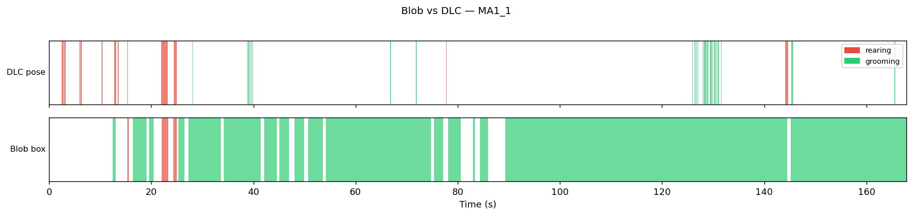

**MA1_2**

|  | other | rearing | grooming |
|---|---|---|---|
| **other** | 1070 | 35 | 2371 |
| **rearing** | 425 | 35 | 110 |
| **grooming** | 80 | 2 | 940 |

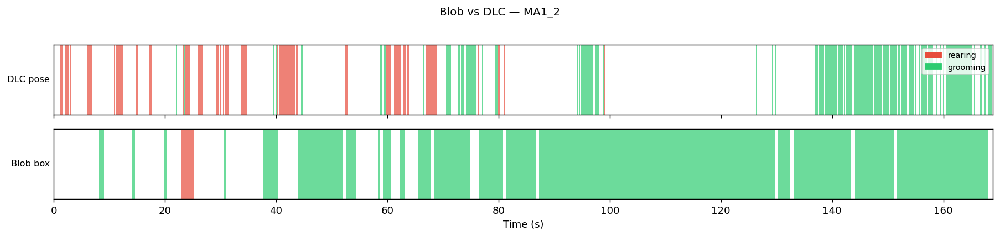

**MA1_3**

|  | other | rearing | grooming |
|---|---|---|---|
| **other** | 2622 | 188 | 916 |
| **rearing** | 779 | 147 | 33 |
| **grooming** | 98 | 151 | 148 |

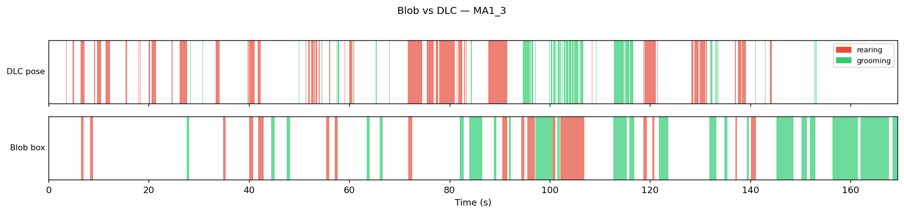

**MA3_1**

|  | other | rearing | grooming |
|---|---|---|---|
| **other** | 1583 | 47 | 2099 |
| **rearing** | 369 | 77 | 743 |
| **grooming** | 47 | 12 | 266 |

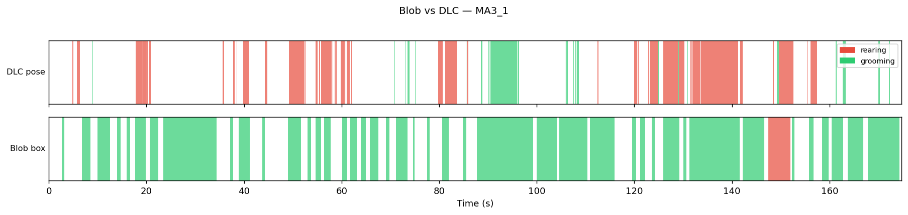

**MA3_2**

|  | other | rearing | grooming |
|---|---|---|---|
| **other** | 3041 | 60 | 1225 |
| **rearing** | 275 | 39 | 72 |
| **grooming** | 201 | 6 | 122 |

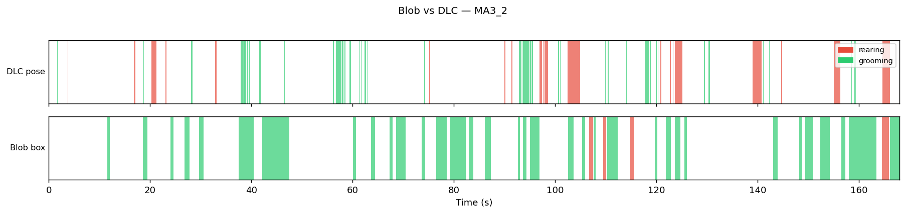

**MA3_3**

|  | other | rearing | grooming |
|---|---|---|---|
| **other** | 1636 | 19 | 1904 |
| **rearing** | 289 | 0 | 364 |
| **grooming** | 103 | 0 | 488 |

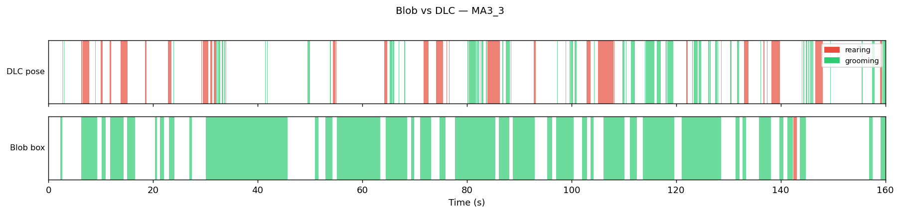

**MA5_1**

|  | other | rearing | grooming |
|---|---|---|---|
| **other** | 924 | 0 | 2065 |
| **rearing** | 104 | 0 | 356 |
| **grooming** | 144 | 0 | 1787 |

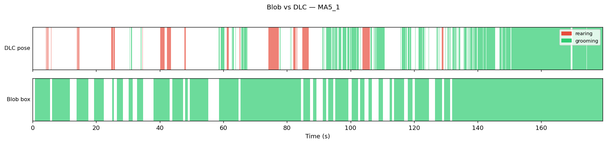

**MA5_2**

|  | other | rearing | grooming |
|---|---|---|---|
| **other** | 2918 | 0 | 666 |
| **rearing** | 1110 | 0 | 177 |
| **grooming** | 249 | 0 | 215 |

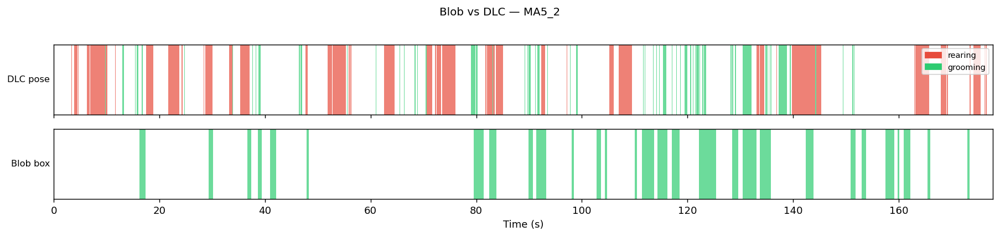

**MA5_3**

|  | other | rearing | grooming |
|---|---|---|---|
| **other** | 2502 | 42 | 1150 |
| **rearing** | 686 | 107 | 507 |
| **grooming** | 60 | 35 | 217 |

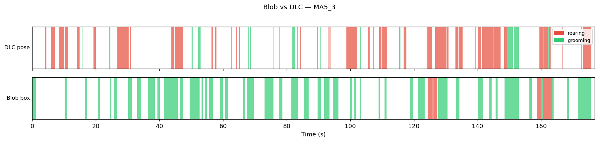

**MA7_1**

|  | other | rearing | grooming |
|---|---|---|---|
| **other** | 2230 | 0 | 1289 |
| **rearing** | 565 | 0 | 436 |
| **grooming** | 105 | 0 | 491 |

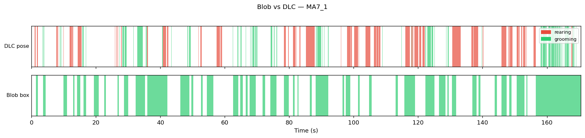

**MA7_2**

|  | other | rearing | grooming |
|---|---|---|---|
| **other** | 3223 | 15 | 756 |
| **rearing** | 642 | 64 | 111 |
| **grooming** | 283 | 0 | 217 |

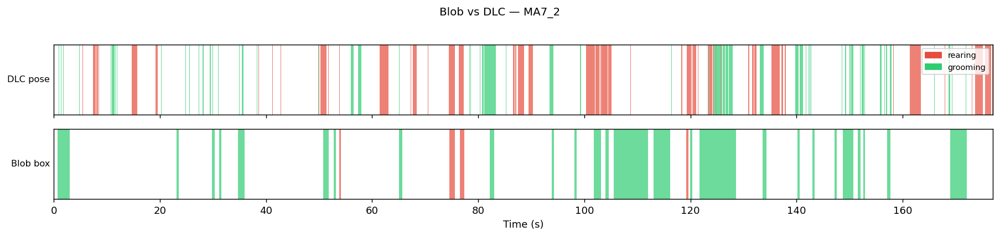

**MA7_3**

|  | other | rearing | grooming |
|---|---|---|---|
| **other** | 3169 | 16 | 1485 |
| **rearing** | 315 | 13 | 153 |
| **grooming** | 73 | 0 | 73 |

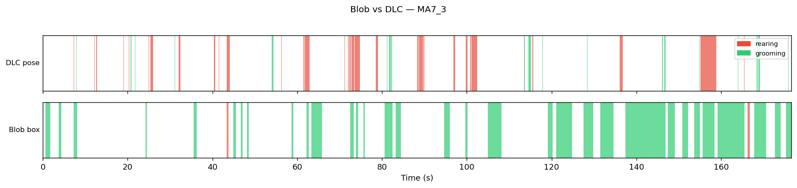

## Reproduce

```bash
pip install scipy numpy pandas matplotlib scikit-learn
python analysis/blob_vs_dlc.py --cohorts MA1 MA3 MA5 MA7
```

Detection thresholds live at the top of `analysis/blob_vs_dlc.py`
(`REAR_AREA_FRAC`, `REAR_ASPECT_MAX`, `GROOM_VEL_MAX`, `GROOM_AREA_CV_MAX`).
Adjust and re-run; this report regenerates from scratch.
