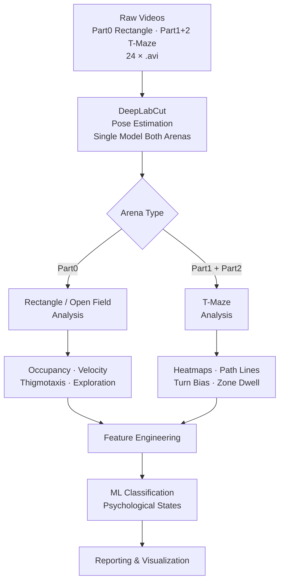

# Rat Behavioral Analysis System
## Project Documentation & Roadmap

> **⚠️ Partially superseded (2026-05-05).**
> This roadmap originally assumed a **single shared DeepLabCut model** for both
> arenas. That assumption has been replaced: the T-maze arm now uses a
> **separate, lighter 5-keypoint DLC project** distinct from the OFT 9-point
> model. Reasons (small subjects, corridor wall occlusion, top-down-only
> camera) and the new repo layout for T-maze data/code live in
> [`docs/tmaze_keypoints_and_layout.md`](../docs/tmaze_keypoints_and_layout.md).
> Treat that doc as the canonical reference for T-maze keypoints and file
> organisation; everything else here still applies.

---

## Project Overview

This project builds an end-to-end pipeline for rat behavioral analysis using computer vision, pose estimation, and machine learning. Two arena types are used, each targeting different behavioral and psychological dimensions:

| Arena | Folder | Rats | Purpose |
|-------|--------|------|---------|
| Rectangle (Open Field) | Part0 | MA1, MA3, MA5, MA7 | Anxiety, locomotion, exploration |
| T-Maze | Part1 + Part2 | MA1, MA3, MA5, MA7 | Spatial memory, decision-making |

A **single DeepLabCut model** is trained on frames from all arenas. Downstream analysis diverges by arena type.

---

## Pipeline Architecture



---

## Stage 1 — Video Collection & Preprocessing

### Dataset

| Part | Arena | Rats | Sessions | Videos |
|------|-------|------|----------|--------|
| Part0 | Rectangle (Open Field) | MA1, MA3, MA5, MA7 | 3 each | 12 |
| Part1 | T-Maze | MA1, MA3 | 3 each | 6 |
| Part2 | T-Maze | MA5, MA7 | 3 each | 6 |

### Tasks
- [ ] Standardize video resolution and frame rate across sessions
- [ ] Label videos with metadata: rat ID, session number, date, condition
- [ ] Trim videos to trial start/end markers
- [ ] Build metadata CSV linking rat IDs, conditions, and arena type

### Deliverables
- Organized video dataset with metadata CSV
- Preprocessing script for batch normalization

---

## Stage 2 — DeepLabCut Analysis

### Purpose
Track body part positions of each rat across all video frames, in both arenas.

### Strategy
- Train a **single DLC model** on frames sampled from all parts (Part0 + Part1 + Part2)
- Diverse training data improves generalization across arenas and lighting
- Body parts: `nose`, `head`, `neck`, `body_center`, `tail_base`

### Tasks
- [ ] Run `dlc_setup.py` — create project, extract frames, label 200–400 total frames
- [ ] Run `dlc_train.py` — train model (target: Test RMSE < 8px)
- [ ] Run `dlc_inference.py` — inference on all videos, export per-arena CSVs

### Output Layout
```
data/dlc_output/
├── rectangle/     # Tracking H5/CSV for Part0 videos
├── tmaze/         # Tracking H5/CSV for Part1 + Part2 videos
├── clean/
│   ├── rectangle/ # Flat clean CSVs ready for OFT analysis
│   └── tmaze/     # Flat clean CSVs ready for T-maze analysis
└── labeled_videos/
```

### Output Format (clean CSV)
```
frame | nose_x | nose_y | head_x | head_y | body_center_x | body_center_y | tail_base_x | tail_base_y
```

---

## Stage 3A — Open Field Test (Rectangle) Analysis

### Purpose
Quantify anxiety, locomotion, and exploratory behavior from the rectangle arena sessions.

### Heatmap Types
| Heatmap | Description | Psychological Relevance |
|---------|-------------|------------------------|
| Occupancy Heatmap | Time spent per spatial bin | Anxiety (thigmotaxis) |
| Velocity Heatmap | Speed at each location | Arousal / inhibition |
| Trajectory Map | Overlaid movement paths | Exploration patterns |

### OFT Metrics
| Metric | Definition | Behavioral Indicator |
|--------|-----------|---------------------|
| Center time | % time in central zone | Low anxiety = more center time |
| Peripheral time | % time near walls (thigmotaxis) | High anxiety = wall-hugging |
| Total distance | Cumulative path length | Locomotion / activity level |
| Mean velocity | Average movement speed | Arousal / sedation |
| Exploration rate | Novel zone entries per minute | Exploratory drive |
| Immobility bouts | Periods of near-zero velocity | Fear / freezing |

### Tasks
- [ ] Define center vs peripheral zones from arena coordinates
- [ ] Calculate all OFT metrics per session per rat
- [ ] Generate per-session and group-average heatmaps
- [ ] Export OFT feature table

---

## Stage 3B — Heatmap Generation (T-Maze)

### Purpose
Visualize spatial occupancy and movement density across the T-maze.

### Heatmap Types
| Heatmap Type | Description | Psychological Relevance |
|---|---|---|
| Occupancy Heatmap | Time spent per maze zone | Preference / avoidance |
| Velocity Heatmap | Speed at each location | Anxiety / exploration drive |
| Entry Frequency Map | How often each zone is entered | Decision-making bias |
| Nose-Point Heatmap | Where rat investigates | Attention / curiosity |
| Path Density Map | Overlaid trajectory lines | Route learning / perseveration |

### Tasks
- [ ] Generate per-session heatmaps for each rat
- [ ] Generate group-average heatmaps per experimental condition
- [ ] Normalize heatmaps for cross-session comparison
- [ ] Export heatmaps as images and numerical arrays (numpy)

---

## Stage 4 — Path Line Analysis (T-Maze)

### Purpose
Extract geometric and kinematic features from movement trajectories within the T-maze.

### Reference Lines
- **Stem line**: Entry point to decision point
- **Left arm line**: Decision point to left goal zone
- **Right arm line**: Decision point to right goal zone
- **Center reference**: Maze midline axis

### Path Metrics
| Metric | Definition | Behavioral Indicator |
|--------|-----------|---------------------|
| Turn bias (L/R ratio) | % of left vs right arm choices | Lateralization, perseveration |
| Path efficiency | Actual path / optimal path length | Cognitive load, confusion |
| Decision latency | Time at choice point | Anxiety, deliberation |
| Velocity profile | Speed over time per zone | Exploration drive, fear |
| Heading angle | Body orientation vs maze axis | Spatial attention |
| Backtrack rate | Frequency of direction reversals | Uncertainty, memory deficit |
| Zone dwell time | Time in stem / arms / goal zones | Preference, avoidance |
| Trajectory smoothness | Curvature variance of path | Motor control, anxiety |

### Tasks
- [ ] Implement zone detection from maze coordinate system
- [ ] Calculate all metrics per trial, per session, per rat
- [ ] Aggregate metrics into a structured feature dataset
- [ ] Visualize path lines colored by velocity or time

---

## Stage 5 — Feature Engineering

### Feature Dataset Structure
Each row = one session. Columns = behavioral metrics from both arenas + labels.

```
rat_id | session | condition | arena |
# OFT features
oft_center_time | oft_peripheral_time | oft_total_distance | oft_velocity |
oft_exploration_rate | oft_immobility_bouts |
# T-Maze features
tmaze_turn_choice | tmaze_latency | tmaze_path_efficiency |
tmaze_velocity_stem | tmaze_velocity_arm | tmaze_dwell_stem |
tmaze_dwell_arm | tmaze_backtrack_rate | tmaze_heading_variance |
# Target
label
```

### Cross-Arena Features
- OFT anxiety score correlated with T-maze decision latency
- OFT locomotion vs T-maze path efficiency
- Within-session variability across arenas

### Labels / Targets
| Label | Description |
|-------|-------------|
| Anxiety level | High / Low — OFT thigmotaxis + T-maze latency |
| Cognitive flexibility | Reversal learning speed (T-maze) |
| Spatial memory | Correct arm choice rate (T-maze) |
| Stress response | Behavioral change from baseline |
| Exploratory drive | Novel zone investigation (OFT) |

---

## Stage 6 — Model Training

### Models to Evaluate
| Model | Use Case |
|-------|----------|
| Random Forest | Baseline classifier, feature importance |
| Gradient Boosting (XGBoost) | High-accuracy tabular classification |
| SVM | Small dataset, binary classification |
| LSTM / GRU | Sequential trial-level temporal patterns |
| CNN on heatmaps | Direct image-based spatial classification |

### Training Strategy
- [ ] Split by rat (not by trial) to prevent data leakage
- [ ] Cross-validate across experimental groups
- [ ] Handle class imbalance with SMOTE or weighted loss
- [ ] Hyperparameter tuning with Optuna

### Evaluation Metrics
- Accuracy, F1-score, AUC-ROC
- Confusion matrix per psychological state
- SHAP feature importance across both arena metrics

---

## Stage 7 — Psychological Analysis & Reporting

### Analysis Outputs
- Per-rat behavioral profiles across sessions and arenas
- OFT vs T-maze correlation matrix
- Group comparison statistics (ANOVA, Mann-Whitney U)
- Learning curve plots per condition
- Decision bias maps (L/R preference over time)

### Report Structure
```
1. Experiment Summary
2. Dataset: Rats, Sessions, Arena Conditions
3. OFT Heatmap Gallery (per group, per session)
4. T-Maze Heatmap & Path Analysis Gallery
5. Cross-Arena Feature Correlations
6. Feature Distributions & Statistics
7. Model Performance Report
8. Psychological State Classifications
9. Conclusions & Behavioral Interpretation
```

---

## Technology Stack

| Component | Tool |
|-----------|------|
| Pose Estimation | DeepLabCut (PyTorch backend) |
| Video Processing | OpenCV |
| Data Processing | Python, Pandas, NumPy |
| Heatmaps & Visualization | Matplotlib, Seaborn, Plotly |
| Path Analysis | SciPy, Shapely |
| ML Models | Scikit-learn, XGBoost, PyTorch |
| Notebooks | Jupyter Lab |

---

## Directory Structure

```
ThesisWork/
├── data/
│   ├── raw_videos/
│   │   ├── Part0/           # Rectangle arena (MA1, MA3, MA5, MA7 × 3)
│   │   ├── Part1/           # T-maze (MA1, MA3 × 3)
│   │   └── Part2/           # T-maze (MA5, MA7 × 3)
│   ├── dlc_output/
│   │   ├── rectangle/       # Raw DLC output for open field videos
│   │   ├── tmaze/           # Raw DLC output for T-maze videos
│   │   ├── clean/
│   │   │   ├── rectangle/   # Cleaned flat CSVs for OFT analysis
│   │   │   └── tmaze/       # Cleaned flat CSVs for T-maze analysis
│   │   └── labeled_videos/  # QC annotated videos
│   ├── heatmaps/
│   └── features/
├── models/
│   ├── dlc_model/           # Trained DeepLabCut project
│   └── classifier/          # Trained psychological state models
├── notebooks/
│   ├── 01_dlc_analysis.ipynb
│   ├── 02_heatmap_generation.ipynb
│   ├── 03_path_analysis.ipynb
│   ├── 04_feature_engineering.ipynb
│   └── 05_model_training.ipynb
├── src/
│   ├── dlc_setup.py
│   ├── dlc_train.py
│   ├── dlc_inference.py
│   ├── heatmap.py
│   ├── path_analysis.py
│   ├── features.py
│   └── model.py
└── documents/
    ├── DEEPLABCUT_PIPELINE.md
    └── RAT_TMAZE_PROJECT.md
```

---

## Key Research Questions

1. Does open-field anxiety (thigmotaxis) predict T-maze decision latency in the same rat?
2. Can spatial heatmap patterns reliably distinguish between anxiety levels in rats?
3. Do path efficiency metrics correlate with cognitive impairment?
4. Can a model trained on one experimental group generalize to another condition?
5. What behavioral features (OFT vs T-maze) are most predictive of psychological state?
6. How do learning curves in path analysis reflect memory formation across sessions?

---

## Detailed Stage Plans

Each stage has a dedicated plan file with tasks, code sketches, acceptance criteria, and output definitions.

| Stage | Plan File |
|-------|-----------|
| 01 — Video Preprocessing | [plans/STAGE_01_VIDEO_PREPROCESSING.md](plans/STAGE_01_VIDEO_PREPROCESSING.md) |
| 02 — DeepLabCut | [plans/STAGE_02_DEEPLABCUT.md](plans/STAGE_02_DEEPLABCUT.md) |
| 03A — OFT Analysis | [plans/STAGE_03A_OFT_ANALYSIS.md](plans/STAGE_03A_OFT_ANALYSIS.md) |
| 03B — T-Maze Heatmaps | [plans/STAGE_03B_TMAZE_HEATMAPS.md](plans/STAGE_03B_TMAZE_HEATMAPS.md) |
| 04 — Path Analysis | [plans/STAGE_04_PATH_ANALYSIS.md](plans/STAGE_04_PATH_ANALYSIS.md) |
| 05 — Feature Engineering | [plans/STAGE_05_FEATURE_ENGINEERING.md](plans/STAGE_05_FEATURE_ENGINEERING.md) |
| 06 — Model Training | [plans/STAGE_06_MODEL_TRAINING.md](plans/STAGE_06_MODEL_TRAINING.md) |
| 07 — Reporting | [plans/STAGE_07_REPORTING.md](plans/STAGE_07_REPORTING.md) |

→ See [plans/README.md](plans/README.md) for the full index with status tracking.

---

## Notes

- All analysis should be blinded to condition labels during feature extraction
- Validate behavioral metrics against established manual scoring (ethogram comparison)
- Model predictions are behavioral proxies — final psychological interpretation requires expert validation
- Cross-arena features (OFT × T-maze) may reveal richer psychological signatures than either arena alone
