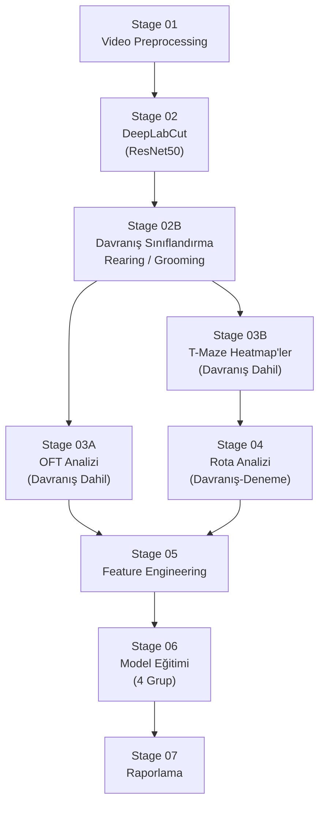

# Pipeline Plan Index

Detailed roadmap plans for each stage of the rat behavioral analysis pipeline.

---

## Stage Overview

**Gruplar:** Kontrol · ASP · Greyfurt · ASP & Greyfurt

---

## Plan Files

| Stage | Dosya | Durum | Açıklama |
|-------|-------|-------|----------|
| 01 | [STAGE_01_VIDEO_PREPROCESSING.md](STAGE_01_VIDEO_PREPROCESSING.md) | Not started | Video envanteri, metadata CSV, kalite kontrolü |
| 02 | [STAGE_02_DEEPLABCUT.md](STAGE_02_DEEPLABCUT.md) | Not started | DLC proje kurulumu, etiketleme, eğitim, çıkarım |
| 02B | [STAGE_02B_BEHAVIOR_CLASSIFICATION.md](STAGE_02B_BEHAVIOR_CLASSIFICATION.md) | Not started | Rearing/grooming tespiti, ethogram, heatmap katmanları |
| 03A | [STAGE_03A_OFT_ANALYSIS.md](STAGE_03A_OFT_ANALYSIS.md) | Not started | OFT metrikleri + davranış bout istatistikleri (4 grup) |
| 03B | [STAGE_03B_TMAZE_HEATMAPS.md](STAGE_03B_TMAZE_HEATMAPS.md) | Not started | T-maze occupancy + rearing/grooming heatmap'leri |
| 04 | [STAGE_04_PATH_ANALYSIS.md](STAGE_04_PATH_ANALYSIS.md) | Not started | Dönüş yanlılığı, rota verimliliği, davranış-deneme entegrasyonu |
| 05 | [STAGE_05_FEATURE_ENGINEERING.md](STAGE_05_FEATURE_ENGINEERING.md) | Not started | OFT + T-maze + Davranış özelliklerini birleştir, 4 grup etiketi |
| 06 | [STAGE_06_MODEL_TRAINING.md](STAGE_06_MODEL_TRAINING.md) | Not started | ML eğitimi, LORO-CV, SHAP değerlendirmesi (4-sınıflı) |
| 07 | [STAGE_07_REPORTING.md](STAGE_07_REPORTING.md) | Not started | Davranışsal profiller, ethogram galerisi, tez görselleri |

---

## How to Update Status

Edit the `Status` field in each plan file header and in the table above:

| Status | Meaning |
|--------|---------|
| `Not started` | Prerequisites not yet met |
| `In progress` | Actively being worked on |
| `Blocked` | Waiting on output from a previous stage |
| `Complete` | All acceptance criteria met |
