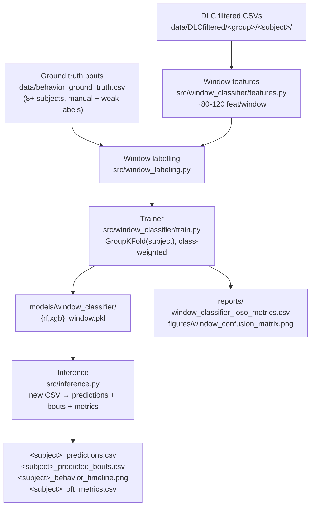

# Window-Level Behaviour Classifier — Implementation Plan

**Tarih:** 2026-05-05
**Kapsam:** Subject-level sınıflandırıcının (n=12) yerine, **pencere-level davranış sınıflandırıcı** geçirme planı. Yeni bir DLC CSV verildiğinde rule-based detector'ın yerine geçecek, retrain edilebilir, T-maze'e taşınabilir bir model.
**İlişkili:**
- `docs/final_report.md` — mevcut subject-level ML sonuçları (cohort F1≈0.27, anxiety_level F1≈0.52, label-leakage caveat'i ile)
- `docs/tmaze_keypoints_and_layout.md` — T-maze 5-keypoint planı; bu classifier ileride o keypoint setine retrain edilecek
- `analysis/cohort_stats.py` — KW + Dunn + PERMANOVA, **bu modelin yerine değil yanına** çalışıyor

---

## 1. Motivasyon

Mevcut `src/train_baseline.py` 4 model × 4 subject-level hedef üretti:
- `group` (kohort): LOOCV F1 ≈ 0.27 — şans seviyesi
- `anxiety_level`: F1 ≈ 0.52 ama label-leakage (target feature'lardan eşikleme ile üretiliyor)
- `rearing_profile`, `grooming_profile`: F1 ≈ 0.45-0.51 sınırda

Sebep modelleme değil **ölçüm sınırı**: n=12, 4 cohort × 3 fare. Hangi CV şemasını seçersen seç, n büyümeden bu rakam değişmez.

**Çözüm: eğitim birimini değiştir.** Subject yerine **kayan zaman penceresi** = 1 örnek. 12 fare × ~5000 frame / 15 frame stride ≈ **~4.000-50.000 örnek**. Subject-grouped LOSO ile subject identity hâlâ leak edemez ama eğitim örneği çok daha bol.

---

## 2. Scope kararı

İki olası window-level hedef var, **A** seçildi:

| Seçenek | Pencere etiketi | n=12 problemini çözer mi |
|---|---|---|
| **A. Behaviour classifier ✓** | `{rearing, grooming, locomotion, immobile, other}` — pencerede ne yapılıyor | Evet — etiket biyolojik, subject-bağımsız |
| B. Window-level cohort classifier | Pencerenin ait olduğu farenin cohort'u | Hayır — aynı n=12 problemi gizli yoldan döner |

A'nın çıktısı **rule-based detector'ın yerine geçer**; aşağı akımdaki bout sayıları, süreler, OFT metrikleri, cohort istatistikleri (KW + Dunn) hep bunun üzerine kurulur.

---

## 3. Pipeline genel görünüm



---

## 4. Faz 1 — Ground truth genişletme

**Mevcut durum:**
- `MA1_2`: 9 rearing + 2 grooming penceresi (`src/behavior_detection.py:GROUND_TRUTH_BY_SUBJECT`)
- `MA5_1`: 5 grooming penceresi
- Toplam ≈ 16 bout — window classifier için **yetersiz**.

**Hedef:** Her cohort'tan en az 2 subject kapsamlı etiketlensin (8/12 subject), ideal olarak 12/12.

**Etiket protokolü:**
1. **Rearing**: tüm bout'lar (subject başına ~10-25, rare class)
2. **Grooming**: tüm bout'lar (subject başına ~5-15)
3. **Locomotion**: random örnekleme yeter
4. **Immobile**: random örnekleme yeter
5. **Other**: kalan her şey (transitions, ambiguous)

**Hızlandırma:** Mevcut rule-based detector'ın **yüksek-confidence** bout'larını **weak label** olarak kullan, sadece düşük-confidence ve negatif pencereleri elle gözden geçir → etiketleme süresi ~1/3'e iner.

**Çıktı:** `data/behavior_ground_truth.csv`
```
subject_id, start_frame, end_frame, label, source  (manual / weak)
```

**Araç:** `analysis/label_bouts.py` — basit frame viewer (matplotlib + slider, video frame'i + DLC overlay, klavye kısayolları).

**Tahmini süre:** araç 1 saat + 8 subject × 30-45 dk etiketleme ≈ **6-7 saat ground truth çalışması**.

---

## 5. Faz 2 — Window feature extractor

**Yeni dosya:** `src/window_classifier/features.py`

```python
input  : DLC CSV + window_size + stride + keypoint_profile
output : DataFrame(subject_id, window_start, window_end, feat_1..feat_N)
```

**Feature paketi (~80-120 feature/pencere):**

| Grup | Hesap | Yaklaşık # |
|---|---|---|
| Per-keypoint stats | her keypoint × (mean, std, min, max, range) × (x, y) | 50 |
| Per-keypoint kinematics | velocity (Δ frame) ve acceleration için (mean, max, std) | 60 |
| Cross-keypoint | htdist, nose-forepaw, body_length, kafa açısı (ear vector) — pencere içi mean/std | 10 |
| Likelihood (tracking quality) | her keypoint için mean likelihood — düşükse model belirsizdir, sinyal | 5 |
| Spatial / bbox | tüm keypoint'lerin bounding box area mean/std (rearing'de küçülür) | 2 |

**Pencere parametreleri (varsayılan):**
- `window_size = 30 frame` (1 saniye, 30 fps) — başlangıç noktası, 60 frame'de denenebilir
- `stride = 15 frame` (50% overlap) eğitim sırasında; `stride = 1` inference sırasında

**Keypoint profili parametreli:** `KEYPOINT_PROFILES = {"oft_9": [...], "tmaze_5": [...]}` — aynı kod iki arenaya da çalışsın.

**Çıktı:** `data/windows_all.parquet` (~50-70k satır, ~100 kolon).

**Tahmini süre:** **2-3 saat kod**.

---

## 6. Faz 3 — Window etiketleme

**Yeni dosya:** `src/window_labeling.py` (Faz 1 + Faz 2 birleşimi)

**Kural:**
- Pencere ≥%50 rearing bout ile örtüşür → `rearing`
- ≥%50 grooming ile örtüşür → `grooming`
- Mean speed > 80 px/s ve labeled bout dışı → `locomotion`
- Mean speed < 5 px/s ve labeled bout dışı → `immobile`
- Ambiguous (%20-50 overlap, transitions) → **atla** (training'de yok ama inference yapacak)

**Beklenen sınıf dağılımı:** `other` ≈ 80%, `locomotion` ≈ 10%, `immobile` ≈ 5%, `rearing` ≈ 3%, `grooming` ≈ 2%. Ciddi imbalance → class-weighted loss şart.

**Çıktı:** `data/windows_labeled.parquet` — Faz 2 çıktısına `label` kolonu eklenmiş hali.

**Tahmini süre:** **1 saat kod**.

---

## 7. Faz 4 — Trainer

**Yeni dosya:** `src/window_classifier/train.py` (mevcut `src/train_baseline.py`'ı baz al, üç şey değiştir).

1. **CV strategy:** `GroupKFold(n_splits=12, groups=subject_id)` — subject-grouped LOSO
2. **Class weights:** `class_weight='balanced'` veya custom (rare class'lara 5-10× ağırlık)
3. **Modeller:** RandomForest + XGBoost. SVM/LogisticReg pencere boyutunda yavaş kalır, atla.

**Hyperparameter search (nested CV içinde):**
- RF: `n_estimators ∈ {200, 500}`, `max_depth ∈ {10, 20, None}`
- XGBoost: `lr ∈ {0.05, 0.1}`, `max_depth ∈ {4, 6, 8}`, `n_estimators ∈ {200, 400}`

**Metrikler:**
- Per-class precision / recall / F1 (özellikle rearing & grooming)
- Confusion matrix (subject-bazlı agregat)
- LOSO içinde her fold'un per-class skoru → varyans bandı
- **Baseline:** rule-based detector'ın aynı pencerelerdeki performansı yan yana

**Çıktılar:**
- `models/window_classifier/{rf,xgb}_window.pkl`
- `models/window_classifier/feature_columns.json`
- `models/window_classifier/label_encoder.pkl`
- `reports/window_classifier_loso_metrics.csv`
- `reports/figures/window_confusion_matrix.png`
- `reports/figures/window_per_subject_f1.png`

**Tahmini süre:** **3-4 saat kod + 30 dk training**.

---

## 8. Faz 5 — Inference pipeline

**Yeni dosya:** `src/inference.py` — hep konuştuğumuz "CSV-in → result-out" sistemi.

```bash
python -m src.inference --csv path/to/<subject>.csv --output report/
```

**Akış:**
1. DLC CSV oku
2. `stride=1` ile pencere feature'larını çıkar (`window_classifier/features.py`)
3. Trained model `predict_proba` → her frame için 5-class olasılık
4. Olasılıkları smooth et (median filter ~15 frame) — gürültü azalt
5. Bout merging: aynı sınıf ardışık frame'leri birleştir, `gap ≤ 15 frame` → merge, `duration < 10 frame` → at (mevcut `behavior_detection.py` ile aynı kural)
6. Mevcut OFT pipeline'ı (`oft_metrics.py`, `activity_heatmap.py`) bout listesini girdi olarak kullanarak çalışır → tüm 16 metrik otomatik hesaplanır

**Çıktılar (her yeni CSV için):**

| Dosya | İçerik |
|---|---|
| `<subject>_predictions.csv` | per-frame: t_s, proba_per_class, predicted_label |
| `<subject>_predicted_bouts.csv` | bout listesi: start/end frame, duration, behaviour, mean_confidence |
| `<subject>_behavior_timeline.png` | mevcut timeline + alttan olasılık eğrisi şeridi |
| `<subject>_oft_metrics.csv` | mevcut 16 OFT metriğinin hepsi |

**Tahmini süre:** **2-3 saat kod**.

---

## 9. Faz 6 — Doğrulama

1. **LOSO metrik tablosu** — her cohort'tan en az 1 subject test edilmiş, rare class F1'leri kabul edilebilir mi
2. **Rule-based baseline karşılaştırma** — `MA1_2` ve `MA5_1` ground truth'larına karşı her iki yaklaşımın F1'i; trained > rule-based mı?
3. **Görsel spot-check** — random 3 subject için inference timeline'ı orijinal video ile yan yana, ~5 dk gözle bak
4. **T-maze hazırlığı** — `window_classifier/features.py` keypoint listesini parametrize ederek yazılırsa T-maze 5-keypoint setiyle aynı kod çalışır

**Tahmini süre:** **0.5-1 gün**.

---

## 10. Faz 7 — Thesis entegrasyonu

`docs/final_report.md`'ye yeni bölüm: **"Window-level behaviour classifier"**

İçerik:
- Method: subject-grouped LOSO, n=12 subjects, ~50k pencere
- Result: macro-F1 = X (LOSO), per-class table, rule-based baseline karşılaştırması
- SHAP / feature importance: hangi keypoint stat'ı hangi davranışı tetikliyor (htdist std → rearing gibi)
- Mevcut subject-level ML bölümünün yerine geçer; `group` classifier KW'a, `anxiety_level` regression'a referans verilir

**Tahmini süre:** **0.5 gün**.

---

## 11. Çıktı spesifikasyonu (yeni CSV verince ne alıyorsun)

### A. Per-frame predictions

`<subject>_predictions.csv`:

| frame | t_s | proba_other | proba_rearing | proba_grooming | proba_locomotion | proba_immobile | predicted |
|---|---|---|---|---|---|---|---|
| 0 | 0.000 | 0.91 | 0.02 | 0.01 | 0.05 | 0.01 | other |
| 1247 | 41.567 | 0.04 | 0.93 | 0.01 | 0.01 | 0.01 | rearing |

### B. Bout listesi

`<subject>_predicted_bouts.csv` — şu anki `*_behavior_bouts.csv` ile aynı şema + `mean_confidence` kolonu.

### C. Timeline

Mevcut `*_behavior_timeline.png` ile aynı görünüm, altta olasılık eğrisi şeridi.

### D. Aggregate metrikler

`<subject>_oft_metrics.csv` — mevcut 16 metrik (rear_pct_time, groom_pct_time, mean_speed, …) — pipeline'ın aşağı akımı **hiç değişmeden** çalışır.

---

## 12. Bu sistem ne YAPMAZ (sınırlar)

- Cohort prediction (n=12, hâlâ ölü) — `analysis/cohort_stats.py` (KW + Dunn) bu işin yeri.
- Anxiety level direkt etiketlemesi (label-leakage olmadan) — sürekli `anxiety_score` regression'ı bu işin yeri.
- Tedavi etkisi p-değeri — KW + PERMANOVA'nın işi.
- Eğitilmemiş davranışları tanıma (freezing, sniffing vs.) — etiketleme + retrain gerekir.

---

## 13. Rule-based detector ile karşılaştırma

| | Rule-based (mevcut) | Window classifier (planlanan) |
|---|---|---|
| Threshold ayarı | Subject başına manuel tweak | Yok — model otomatik |
| Yeni keypoint set'ine adaptasyon | Tüm kuralları yeniden yaz | Ground truth ile retrain |
| Confidence skoru | Yok (binary) | Her frame için olasılık |
| T-maze'e taşıma | Köşe oklüzyonu kuralları kırar | 5-keypoint profili ile retrain, çalışır |
| Ground truth doğrulama | 2 subject (MA1_2, MA5_1) | LOSO ile 12 subject hepsi |
| Yeni grup videosu | Eski thresholdlar uymayabilir | Aynı model çalışır (same arena, same keypoints) |

---

## 14. Somut başlangıç sırası

| # | Adım | Süre | Çıktı |
|---|---|---|---|
| 1 | `analysis/label_bouts.py` etiketleme aracı | 1 saat | etiketleyebilir hâle gelmek |
| 2 | 8 subject etiketle (Faz 1) | 6 saat | `data/behavior_ground_truth.csv` |
| 3 | `src/window_classifier/features.py` (Faz 2) | 2-3 saat | `data/windows_all.parquet` |
| 4 | `src/window_labeling.py` (Faz 3) | 1 saat | `data/windows_labeled.parquet` |
| 5 | `src/window_classifier/train.py` (Faz 4) | 3-4 saat + 30 dk training | model pickle + LOSO metrik raporu |
| 6 | `src/inference.py` (Faz 5) | 2-3 saat | CSV-in → result-out |
| 7 | Doğrulama + thesis yazımı (Faz 6-7) | 1 gün | `docs/final_report.md` yeni bölüm |

**Toplam:** optimist senaryoda ~3-5 gün, gerçekçi senaryoda 1-2 hafta.

**Kritik path:** Faz 1 (ground truth) **bottleneck**. Etiketleme aracı bittiği gibi etiketleme başlamalı; Faz 2-3-4 paralelde yazılabilir ama eğitim için ground truth'a bağımlı.

---

## 15. Dosya/dizin haritası (planlanan eklemeler)

```
src/window_classifier/
├── __init__.py
├── features.py                     # Faz 2 — keypoint-profile aware
├── label_join.py                   # Faz 3
├── train.py                        # Faz 4
└── infer.py                        # Faz 5

analysis/
└── label_bouts.py                  # Faz 1 — interaktif etiketleme aracı

data/
├── behavior_ground_truth.csv       # Faz 1 çıktısı
├── windows_all.parquet             # Faz 2 çıktısı
└── windows_labeled.parquet         # Faz 3 çıktısı

models/
└── window_classifier/
    ├── rf_window.pkl               # Faz 4
    ├── xgb_window.pkl
    ├── feature_columns.json
    └── label_encoder.pkl

reports/
├── window_classifier_loso_metrics.csv      # Faz 4
└── figures/
    ├── window_confusion_matrix.png         # Faz 4
    └── window_per_subject_f1.png

docs/
└── window_classifier_plan.md       # bu dosya
```
