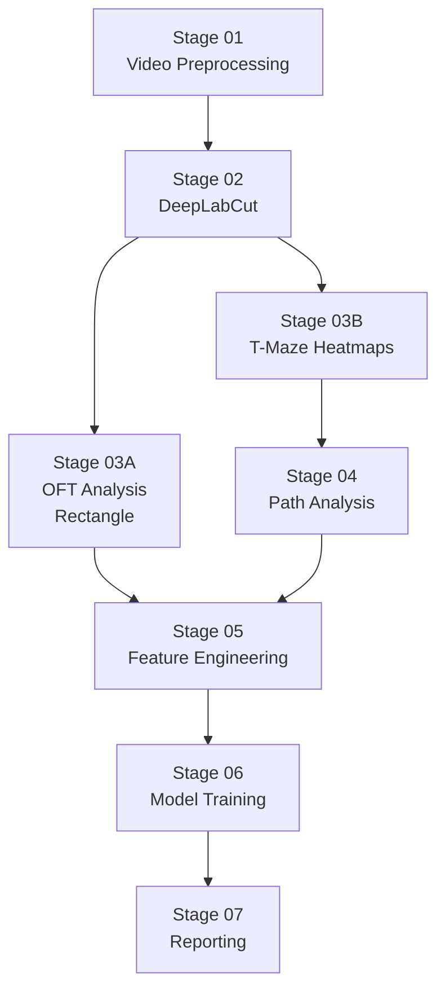

# Pipeline Plan Index

Detailed roadmap plans for each stage of the rat behavioral analysis pipeline.

---

## Stage Overview

---

## Plan Files

| Stage | File | Status | Description |
|-------|------|--------|-------------|
| 01 | [STAGE_01_VIDEO_PREPROCESSING.md](STAGE_01_VIDEO_PREPROCESSING.md) | Not started | Video inventory, metadata CSV, quality check |
| 02 | [STAGE_02_DEEPLABCUT.md](STAGE_02_DEEPLABCUT.md) | Not started | DLC project setup, labeling, training, inference |
| 03A | [STAGE_03A_OFT_ANALYSIS.md](STAGE_03A_OFT_ANALYSIS.md) | Not started | Open field test metrics (thigmotaxis, center time, velocity) |
| 03B | [STAGE_03B_TMAZE_HEATMAPS.md](STAGE_03B_TMAZE_HEATMAPS.md) | Not started | T-maze occupancy and velocity heatmaps |
| 04 | [STAGE_04_PATH_ANALYSIS.md](STAGE_04_PATH_ANALYSIS.md) | Not started | Turn bias, path efficiency, decision latency |
| 05 | [STAGE_05_FEATURE_ENGINEERING.md](STAGE_05_FEATURE_ENGINEERING.md) | Not started | Merge OFT + T-maze features, label assignment |
| 06 | [STAGE_06_MODEL_TRAINING.md](STAGE_06_MODEL_TRAINING.md) | Not started | ML training, LORO-CV, SHAP evaluation |
| 07 | [STAGE_07_REPORTING.md](STAGE_07_REPORTING.md) | Not started | Behavioral profiles, statistics, thesis figures |

---

## How to Update Status

Edit the `Status` field in each plan file header and in the table above:

| Status | Meaning |
|--------|---------|
| `Not started` | Prerequisites not yet met |
| `In progress` | Actively being worked on |
| `Blocked` | Waiting on output from a previous stage |
| `Complete` | All acceptance criteria met |
