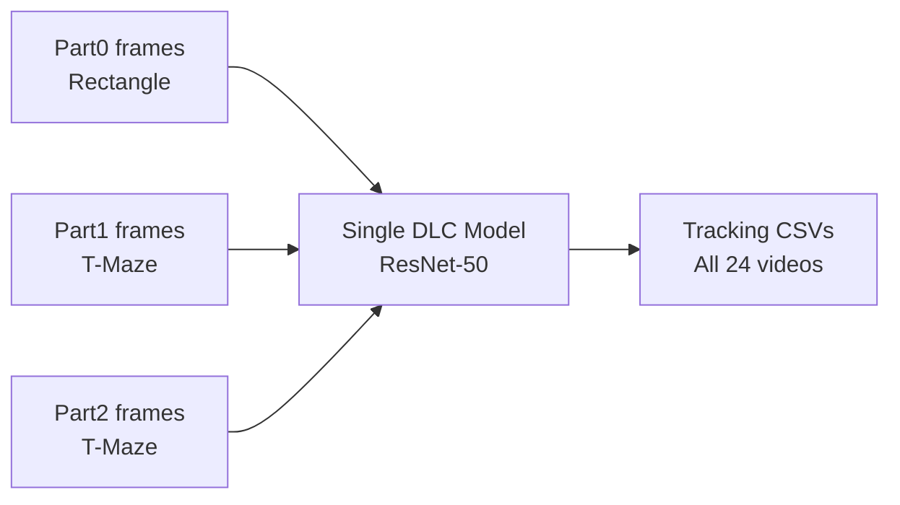

# Stage 02 — DeepLabCut Analysis
## Plan & Roadmap

---

## Objective

Train a single DeepLabCut pose estimation model on frames from all arenas, run inference on all 24 videos, and export clean per-session tracking CSVs for downstream analysis.

---

## Status

- [ ] In progress

---

## Strategy

A **single DLC model** covers both the rectangle (open field) and T-maze arenas. The rat body parts are visually identical regardless of arena, and including frames from both environments improves model generalization.



---

## Sub-stages

### 2.1 — Project Creation (`dlc_setup.py`)

**Script:** `src/dlc_setup.py`

- [ ] Run `dlc_setup.py` to create DLC project
- [ ] Confirm all 24 `.avi` videos are registered in `config.yaml`
- [ ] Verify body parts and skeleton saved to config

**Body parts:** `nose`, `head`, `neck`, `body_center`, `tail_base`

**Expected output:**
```
models/dlc_model/rat_behavior-kaank-YYYY-MM-DD/
├── config.yaml
└── videos/  (symlinks to raw .avi files)
```

### 2.2 — Frame Extraction

- [ ] Extract ~20 frames per video (480 total max) using `kmeans`
- [ ] Confirm frames are extracted from **both** arena types
- [ ] Visually verify extracted frames cover diverse postures

**Target:** 200–400 labeled frames across all videos

### 2.3 — Frame Labeling

- [ ] Launch labeling GUI: `deeplabcut.label_frames(config_path)`
- [ ] Label all 5 body parts per frame
- [ ] Label at least 10 frames from rectangle arena sessions
- [ ] Label at least 10 frames from T-maze sessions
- [ ] Save regularly (Ctrl+S)

**Labeling shortcuts:**
| Action | Key |
|--------|-----|
| Next frame | `D` |
| Previous frame | `A` |
| Save | `Ctrl+S` |
| Place label | Left click |

- [ ] Run `deeplabcut.check_labels()` to verify no misplaced labels

### 2.4 — Training (`dlc_train.py`)

**Script:** `src/dlc_train.py`

- [ ] Create training dataset: `deeplabcut.create_training_dataset()`
- [ ] Patch `pose_cfg.yaml` for RTX 3060 (`batch_size=8`)
- [ ] Start training: `maxiters=50000`
- [ ] Monitor loss in terminal — should decrease and plateau
- [ ] Save checkpoints every 5000 iterations

**VRAM guidance (RTX 3060 6GB):**
| batch_size | VRAM usage |
|-----------|------------|
| 8 | ~4.5 GB — safe |
| 16 | ~7 GB — too high |

### 2.5 — Evaluation

- [ ] Run `deeplabcut.evaluate_network()`
- [ ] Check Train RMSE and Test RMSE

| Metric | Acceptable | Good |
|--------|-----------|------|
| Train RMSE | < 5 px | < 3 px |
| Test RMSE | < 8 px | < 5 px |

- [ ] If Test RMSE > 8px → extract outlier frames and refine (see 2.6)

### 2.6 — Refinement (if needed)

- [ ] Extract uncertain frames from high-error videos
- [ ] Re-label in `refine_labels` GUI
- [ ] Merge into dataset and retrain with `maxiters=75000`

### 2.7 — Inference (`dlc_inference.py`)

**Script:** `src/dlc_inference.py`

- [ ] Run inference on all 24 videos
- [ ] Apply median filter (window=5 frames)
- [ ] Verify output CSVs exist for all videos
- [ ] Spot-check labeled QC videos in `dlc_output/labeled_videos/`

**Output structure:**
```
data/dlc_output/
├── rectangle/          # Part0 H5 + CSV
├── tmaze/              # Part1 + Part2 H5 + CSV
├── clean/
│   ├── rectangle/      # Flat CSVs ready for OFT analysis
│   └── tmaze/          # Flat CSVs ready for T-maze analysis
└── labeled_videos/     # QC annotated videos
```

### 2.8 — Tracking Quality Audit

- [ ] Load all clean CSVs and report % frames above likelihood threshold (0.6)
- [ ] Flag any session with < 80% valid frames for re-inspection
- [ ] Check interpolation gaps — no gap > 30 frames should remain filled

---

## Acceptance Criteria

- All 24 videos have a corresponding clean CSV
- Test RMSE < 8px
- > 80% of frames pass likelihood threshold (≥ 0.6) for all videos
- At least one labeled QC video per arena type looks visually correct

---

## Key Files

| File | Role |
|------|------|
| `src/dlc_setup.py` | Project creation, frame extraction, labeling |
| `src/dlc_train.py` | Training + evaluation |
| `src/dlc_inference.py` | Inference + export |
| `documents/DEEPLABCUT_PIPELINE.md` | Detailed DLC reference |

---

## Next Steps

→ **Stage 03A:** `STAGE_03A_OFT_ANALYSIS.md` (rectangle videos)
→ **Stage 03B:** `STAGE_03B_TMAZE_HEATMAPS.md` (T-maze videos)
