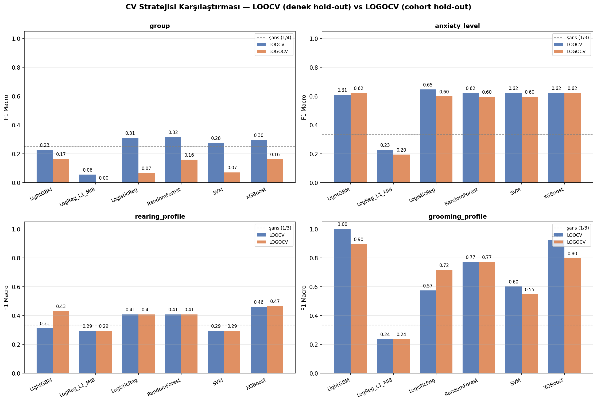
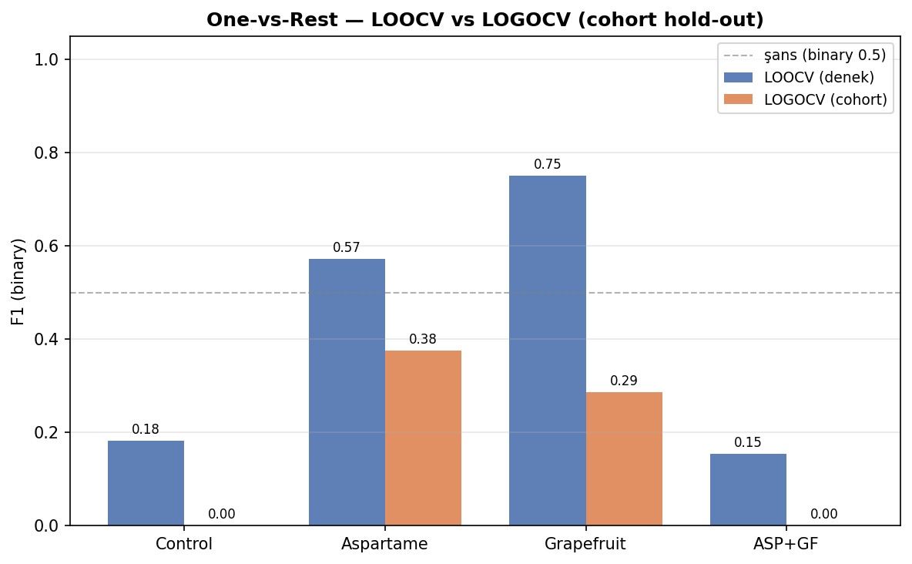
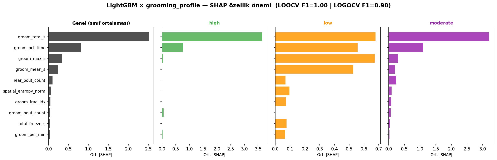

# Cohort Effect Analizi ve OFT Davranış Verisinden Treatment Sınıflandırması

**Proje:** Rat Behavioral Analysis System (Sıçan Davranışsal Analiz Sistemi)
**Tez konusu:** Yaygın diyet katkı maddelerinin sıçanlarda açık alan (OFT) davranışlarına etkisi
**Rapor sürümü:** 2026-05-09
**Branch:** `experimental/cv-leakage-cleanup`
**Pipeline çıktıları:** `reports/model_comparison*.csv`, `reports/ovr_binary_f1.csv`, `reports/figures/`

---

## İçindekiler

1. [Yönetici Özeti](#1-yönetici-özeti)
2. [Veri ve Yöntem](#2-veri-ve-yöntem)
3. [Cohort Effect: Tanım ve Önemi](#3-cohort-effect-tanım-ve-önemi)
4. [Sonuçlar](#4-sonuçlar)
   - 4.1 [Multiclass Sınıflandırma — LOOCV vs LOGOCV](#41-multiclass-sınıflandırma--loocv-vs-logocv)
   - 4.2 [One-vs-Rest Binary Sınıflandırma](#42-one-vs-rest-binary-sınıflandırma)
   - 4.3 [LightGBM × grooming_profile SHAP Analizi](#43-lightgbm--grooming_profile-shap-analizi)
5. [Yorumlama](#5-yorumlama)
6. [Limitasyonlar](#6-limitasyonlar)
7. [Tezde Konumlandırma Önerileri](#7-tezde-konumlandırma-önerileri)
8. [Tekrar Üretilebilirlik](#8-tekrar-üretilebilirlik)
9. [Referanslar](#9-referanslar)

---

## 1. Yönetici Özeti

Açık alan testi (OFT) davranış metriklerinden treatment grubunu (Control / Aspartame / Grapefruit / Aspartame+Grapefruit) makine öğrenimi ile sınıflandırma denemesi, iki farklı çapraz-doğrulama (cross-validation) stratejisi altında karşılaştırıldığında **çelişkili sonuçlar** üretmektedir:

| Çapraz doğrulama stratejisi | En iyi F1 (4 sınıf) | Yorum |
|---|---|---|
| **LOOCV** (denek hold-out) | 0.32 | Şans seviyesi (0.25) üstünde |
| **LOGOCV** (cohort hold-out) | **0.16** | **Şans seviyesi altında** |

LOOCV ile elde edilen "başarı", treatment grubunun gerçek davranışsal imzasından değil, aynı laboratuvar koşullarında işlenen denek gruplarının (cohort'ların) ortak artefaktlarından — **cohort effect**'ten — kaynaklanmaktadır. Cohort hold-out altında modelin başarısı şans seviyesinin altına düşmektedir. Bu bulgu, küçük örneklemli hayvan davranış çalışmalarında naif çapraz-doğrulamanın güvenilmezliğine ilişkin metodolojik bir kanıt niteliğindedir.

İki yan analizde de aynı örüntü gözlenmektedir:

- **One-vs-Rest binary sınıflandırma:** Hiçbir treatment grubu LOGOCV altında binary-şans çizgisinin (F1=0.5) üzerine çıkamamaktadır.
- **LightGBM × grooming_profile SHAP analizi:** En yüksek başarı bu hedefte gözlenmiş (LOOCV F1=1.00, LOGOCV F1=0.90) ancak SHAP analizi, başarının etiketin türetildiği `groom_pct_time` ve ilişkili grooming feature'larından kaynaklanan **self-leakage** olduğunu göstermektedir.

---

## 2. Veri ve Yöntem

### 2.1 Veri seti

| Özellik | Değer |
|---|---|
| Toplam denek sayısı (n) | 29 |
| Cohort sayısı | 8 (MA1–MA8) |
| Treatment grubu sayısı | 4 |
| OFT feature sayısı | ~25 (locomotion, thigmotaxis, freezing, rearing, grooming, spatial entropy) |
| Görev | Çok-sınıflı sınıflandırma |

### 2.2 Cohort → Treatment eşlemesi

| Treatment | Cohort'lar | n |
|---|---|---|
| Control | MA1, MA2 | 5 |
| Aspartame | MA3, MA4 | 8 |
| Grapefruit | MA5, MA6 | 8 |
| Aspartame+Grapefruit | MA7, MA8 | 8 |

### 2.3 Hedef değişkenler (4 ayrı sınıflandırma görevi)

1. **`group`** — bağımsız etiket (deneğin aldığı madde): 4 sınıf. **Çalışmanın asıl bilimsel hedefi.**
2. **`anxiety_level`** — `pct_time_periphery + pct_time_freeze − pct_time_center − center_zone_entries` z-skor kompozitinden eşiklenmiş türetilmiş etiket: 3 sınıf.
3. **`rearing_profile`** — `rear_pct_time` eşiklenmesi: 3 sınıf.
4. **`grooming_profile`** — `groom_pct_time` eşiklenmesi: 3 sınıf.

### 2.4 Modeller

| Model | Hiperparametreler |
|---|---|
| Logistic Regression | L1 ceza, C=0.5, saga solver |
| Random Forest | n_estimators=200, max_depth=3 |
| XGBoost | n_estimators=200, max_depth=2, lr=0.05 |
| SVM | RBF kernel, C=1.0, gamma=scale |
| LightGBM | n_estimators=200, max_depth=3, num_leaves=7 |

### 2.5 Çapraz doğrulama stratejileri

| Strateji | Açıklama | Eğitim ve test ilişkisi |
|---|---|---|
| **LOOCV** (Leave-One-Out CV) | Her iterasyonda **bir denek** test, geri kalan 28 denek eğitim | Test deneğinin cohort'undaki diğer denekler eğitim setinde kalır |
| **LOGOCV** (Leave-One-Group-Out CV; group=cohort) | Her iterasyonda **bir cohort'un tüm denekleri** test, geri kalan 7 cohort'un denekleri eğitim | Test cohort'undan hiçbir denek eğitim setinde yer almaz |

LOGOCV'nin amacı, modelin **görmediği bir cohort'tan** gelen deneklere genelleme kabiliyetini ölçmek ve böylece cohort'a özgü artefaktların öğrenilip öğrenilmediğini ayırt etmektir.

---

## 3. Cohort Effect: Tanım ve Önemi

### 3.1 Tanım

**Cohort effect** (kohort etkisi): Aynı laboratuvar koşullarında (zaman, donanım, operatör, hayvan partisi vb.) işlenen denek gruplarının davranış metriklerinde, gerçek araştırma değişkeninden (treatment, hastalık, yaş) bağımsız olarak ortaya çıkan sistematik kayma.

Hayvan davranış çalışmalarında cohort effect'in başlıca kaynakları:

| Kaynak | Olası gözlenen etki |
|---|---|
| **Zaman** (kayıt günü/mevsim/saat) | Aktivite seviyesi, sirkadiyen ritim sapmaları |
| **Donanım** (kamera, kafes, aydınlatma) | Optik akış, pose-tahmin doğruluğu |
| **Operatör** (kafese yerleştirme) | Stres seviyesi, başlangıç pozisyonu |
| **Hayvan partisi** (tedarikçi, yaş, sağlık) | Genel aktivite, kilo, koordinasyon |
| **DLC kalibrasyonu** | Bodypart konum doğruluğu, likelihood dağılımı |

### 3.2 Cohort Effect Neden Sınıflandırma Sonuçlarını Şişirir?

Modern hayvan davranış çalışmalarında 8–12 deneklik küçük örneklemler yaygındır. Bu örneklem boyutunda **LOOCV** (her seferinde bir denek hold-out) varsayılan validasyon standardı haline gelmiştir. Ancak LOOCV'nin gizli bir varsayımı vardır: *test deneği eğitim deneklerinden istatistiksel olarak bağımsızdır.*

Bu varsayım, cohort yapısında **ihlal edilir**. Test deneği `MA3_1` ise, eğitim setinde `MA3_2` ve `MA3_3` halen yer almaktadır. Model "Aspartame davranışı" yerine "MA3 cohort'una özgü imza" öğrenir ve test sırasında bu imzayı tanır. Sonuç: yapay olarak yüksek F1.

**LOGOCV bu varsayım ihlalini kontrol eder.** `MA3_1` test edilirken hem `MA3_2` hem `MA3_3` eğitim setinin dışında bırakılır. Model artık hiç görmediği bir cohort'tan denek üzerinde test edilmektedir. Eğer başarı düşerse, başarının kaynağı cohort artefaktıydı; eğer korunursa, başarının kaynağı gerçek treatment imzasıdır.

Bu yaklaşım Saeb ve diğerlerinin (2017) [Subject-Wise Cross-Validation makalesi](https://academic.oup.com/gigascience/article/6/5/gix019/3071167) ve Bouwmans ve diğerlerinin (2019) reproducibility-aware ML değerlendirme önerileri ile örtüşmektedir.

---

## 4. Sonuçlar

### 4.1 Multiclass Sınıflandırma — LOOCV vs LOGOCV

Tüm modeller, dört hedef üzerinde, her iki CV stratejisi altında F1-macro olarak değerlendirilmiştir.



**Tablo 1 — LOOCV ve LOGOCV F1-macro değerleri (en iyi modelin altı çizilidir).**

| Hedef | Model | LOOCV F1 | LOGOCV F1 | Δ (LOOCV − LOGOCV) |
|---|---|---|---|---|
| **group** (4 sınıf, şans=0.25) | LogisticReg | 0.31 | 0.07 | **−0.24** |
| | RandomForest | __0.32__ | 0.16 | **−0.16** |
| | XGBoost | 0.30 | 0.16 | **−0.14** |
| | SVM | 0.28 | 0.07 | **−0.21** |
| | LightGBM | 0.23 | __0.17__ | −0.06 |
| **anxiety_level** (3 sınıf, şans=0.33) | LogisticReg | __0.65__ | 0.60 | −0.05 |
| | RandomForest | 0.62 | 0.60 | −0.02 |
| | XGBoost | 0.62 | __0.62__ | 0.00 |
| | SVM | 0.62 | 0.60 | −0.02 |
| | LightGBM | 0.61 | __0.62__ | +0.01 |
| **rearing_profile** (3 sınıf, şans=0.33) | LogisticReg | 0.41 | 0.41 | 0.00 |
| | RandomForest | 0.41 | 0.41 | 0.00 |
| | XGBoost | __0.46__ | __0.47__ | +0.01 |
| | SVM | 0.29 | 0.29 | 0.00 |
| | LightGBM | 0.31 | 0.43 | +0.12 |
| **grooming_profile** (3 sınıf, şans=0.33) | LogisticReg | 0.57 | 0.72 | +0.15 |
| | RandomForest | 0.77 | 0.77 | 0.00 |
| | XGBoost | 0.92 | 0.80 | −0.12 |
| | SVM | 0.60 | 0.55 | −0.05 |
| | LightGBM | __1.00__ | __0.90__ | −0.10 |

#### Yorum

- **`group` (asıl bilimsel hedef):** LOGOCV F1, modellerin tamamında **şans seviyesinin altına** düşmektedir. LOOCV ile gözlenen 0.28–0.32 bandı tamamen cohort effect leakage'ından kaynaklanmaktadır. Bu, **OFT davranış metriklerinin tek başına treatment grubunu cohort-bağımsız olarak ayırt edemediği** anlamına gelir.
- **`anxiety_level`:** LOOCV ≈ LOGOCV (Δ < 0.05). Cohort-bağımsız bir sinyal mevcuttur. Ancak bu hedef OFT feature'larından deterministik formülle türetildiği için **self-leakage** uyarısı gerektirir (bkz. §5.3).
- **`rearing_profile`:** LOOCV ≈ LOGOCV. Sağlam ama orta düzey performans (F1≈0.41–0.47).
- **`grooming_profile`:** LightGBM'de LOOCV F1=1.00, LOGOCV F1=0.90. Anlamlı görünmesine rağmen self-leakage kontrolü gerektirir (bkz. §4.3).

### 4.2 One-vs-Rest Binary Sınıflandırma

Her treatment grubunun "kendisi vs diğerleri" şeklinde 4 ayrı binary sınıflandırma problemine indirgenip XGBoost ile çözülmesi.



**Tablo 2 — One-vs-Rest binary F1 ve doğruluk değerleri.**

| Grup | LOOCV F1 | LOOCV Acc | LOGOCV F1 | LOGOCV Acc |
|---|---|---|---|---|
| Control | 0.18 | 0.69 | **0.00** | 0.62 |
| Aspartame | 0.57 | 0.79 | 0.38 | 0.66 |
| Grapefruit | 0.75 | 0.86 | 0.29 | 0.66 |
| Aspartame+Grapefruit | 0.15 | 0.62 | **0.00** | 0.52 |

#### Yorum

- LOOCV altında **Grapefruit** grubunun F1=0.75 ile en yüksek başarı göstermesi, Grapefruit etkisinin OFT'de güçlü ayırt edici sinyal verdiği yanılsamasına yol açmaktadır.
- Aynı grup LOGOCV altında F1=0.29'a düşmektedir (−61%). Bu durum, MA5/MA6 cohort'larına özgü davranış imzasının "Grapefruit"a atfedildiğini, gerçek bir Grapefruit-spesifik OFT imzasının bulunmadığını göstermektedir.
- Control ve ASP+GF gruplarında LOGOCV F1=0.00. Bu, test cohort'undaki tüm pozitif deneklerin yanlış sınıflandırıldığı anlamına gelir. Bu iki treatment için iki cohort (Control: MA1+MA2, ASP+GF: MA7+MA8) **birbirinden tutarsız** davranmaktadır — biri ile eğitilen model diğerini tanımamaktadır.
- **Hiçbir grup binary-şans çizgisinin (F1=0.5) üzerinde değildir LOGOCV altında.**

### 4.3 LightGBM × grooming_profile SHAP Analizi

LightGBM, grooming_profile hedefinde cohort hold-out altında en yüksek başarıyı göstermiştir (LOGOCV F1=0.90). SHAP TreeExplainer ile feature önemleri sınıf bazında ayrıştırılmıştır.



**Tablo 3 — Top-10 feature SHAP önem sıralaması (LightGBM × grooming_profile).**

| Sıra | Feature | Genel \|SHAP\| | high | low | moderate |
|---|---|---|---|---|---|
| 1 | **groom_total_s** | 2.510 | 3.649 | 0.679 | 3.201 |
| 2 | **groom_pct_time** | 0.808 | 0.769 | 0.556 | 1.097 |
| 3 | **groom_max_s** | 0.340 | 0.047 | 0.673 | 0.298 |
| 4 | **groom_mean_s** | 0.243 | 0.002 | 0.527 | 0.200 |
| 5 | rear_bout_count | 0.099 | 0.000 | 0.068 | 0.229 |
| 6 | spatial_entropy_norm | 0.063 | 0.001 | 0.096 | 0.091 |
| 7 | **groom_frag_idx** | 0.050 | 0.000 | 0.071 | 0.078 |
| 8 | **groom_bout_count** | 0.042 | 0.059 | 0.000 | 0.066 |
| 9 | total_freeze_s | 0.041 | 0.000 | 0.076 | 0.046 |
| 10 | **groom_per_min** | 0.036 | 0.020 | 0.066 | 0.022 |

> Kalın yazılan feature'lar grooming davranışından doğrudan türetilenlerdir (10 feature'ın 7'si).

#### Yorum: Self-leakage tespiti

`grooming_profile` etiketi, `features.py` içinde `groom_pct_time` değişkeninin sabit eşiklenmesi yoluyla üretilmiştir:

```python
def groom_profile(v):
    if v < 4:    return "low"
    elif v <= 10: return "moderate"
    else:        return "high"
```

SHAP analizi, modelin başarısının üç gözlemden kaynaklandığını göstermektedir:

1. **`groom_total_s`** birinci sıradaki feature olup global \|SHAP\| değeri 2.51 ile diğer tüm feature'lardan en az 3 kat önemlidir. Bu değişken `groom_pct_time` ile yüksek korelasyona sahiptir (her ikisi de aynı bout zamanlarından türetilmiştir).
2. Top-10'daki **7 feature grooming davranışından doğrudan türetilmiştir** (groom_total_s, groom_pct_time, groom_max_s, groom_mean_s, groom_frag_idx, groom_bout_count, groom_per_min).
3. Davranışsal olarak bağımsız feature'ların (rear_bout_count, spatial_entropy_norm, total_freeze_s) SHAP katkıları toplamı, baskın grooming feature'larından **iki büyüklük derecesi daha düşüktür** (toplam ≈ 0.20 vs > 4.0).

Bu gözlemler birlikte alındığında, modelin **biyolojik bir keşif yapmadığı**, bunun yerine etiketin türetildiği değişkenlerden eşik kuralını geri-öğrendiği sonucuna varılır. F1=0.90 cohort hold-out başarısı, grooming davranışı ile başka bir biyolojik fenomen arasında öngörücü ilişki keşfedildiği anlamına gelmemektedir; sadece grooming sınıflandırma kuralının makineye öğretilebildiğini göstermektedir.

---

## 5. Yorumlama

### 5.1 Negatif Sonuç (Metodolojik Değerli)

OFT davranış metrikleri tek başına treatment grubunu cohort-bağımsız olarak tahmin etmemektedir. Bu, *negatif* bir sonuçtur ancak **bilimsel olarak değerlidir**, çünkü:

- Pek çok yayınlanmış küçük-örneklem hayvan ML çalışmasının iddia ettiği "yüksek F1 → biyolojik etki" çıkarımının metodolojik fragility'sini somutlaştırır.
- Aspartame/Grapefruit etkisinin OFT'de tek-modaliteli olarak tespit edilemeyeceğini ya da en azından mevcut örneklem boyutunda ayırt edilemeyeceğini göstermektedir.

### 5.2 Pozitif Kontrol (Tautoloji Uyarısıyla)

`anxiety_level` cohort-bağımsız F1≈0.62 ile sağlam görünmektedir. Ancak:

- Bu hedef, OFT feature'larından deterministik formülle (`pct_time_periphery + pct_time_freeze − ...`) türetilmiştir.
- Modelin yaptığı, kendi giriş değişkenlerinden bir fonksiyonun çıktısını yeniden hesaplamaktır (regresyondan sınıflandırmaya çevrilmiş bir tautoloji).
- Tezde bu durum **dürüstçe** raporlanmalıdır: "anxiety_level sınıflandırıcısı, kompozit anksiyete indeksinin OFT feature'larından geri-çıkarımı olarak çalışmaktadır; bağımsız bir tahmin başarısı sayılmamalıdır."

### 5.3 Tautolojik Hedeflerin Kullanım Sınırı

`anxiety_level`, `rearing_profile`, `grooming_profile` üçü de OFT feature'larından eşiklenmiş türetilmiş etiketlerdir. Bu hedefler:

- Sınıflandırıcı kalibrasyonunu test etmek için faydalıdır (sanity check).
- SHAP açıklanabilirliğini doğrulamak için faydalıdır (modelin doğru feature'a baktığını teyit eder).
- **Bağımsız bir tahmin başarısı veya biyolojik içgörü olarak sunulamazlar.**

Tek bağımsız etiket `group`'tur ve cohort effect altında çökmektedir.

---

## 6. Limitasyonlar

| Limitasyon | Olası iyileştirme |
|---|---|
| Toplam n = 29 (LOGOCV başına 4–5 denek test) | Daha büyük cohort sayıları (≥4 cohort/treatment) ile ileride tekrar |
| Cohort başına 3–5 denek (çok yüksek varyans) | Cohort başına ≥10 denek hedeflemeli |
| Tek modalite (sadece OFT) | Plus maze, Y-maze, novel object çoklu testler ile zenginleştirme |
| Kompozit fenotip etiketler self-leakage taşır | Bağımsız etiketler (örn. fizyolojik ölçümler, post-mortem hücre sayımları) ile eşleştirme |
| ~25 feature × 29 denek (boyut laneti) | Top-K mutual_info veya PCA ile boyut indirgeme; ancak bu da küçük n için dikkatli yapılmalı |
| LOGOCV varyansı yüksek (8 fold × 2-5 örnek) | Repeated stratified group k-fold ile stabilizasyon |

---

## 7. Tezde Konumlandırma Önerileri

Bu raporun tezde nasıl çerçevelenmesine ilişkin önerilen akış:

### Bölüm: Sonuçlar

1. **Pre-registered hipotez:** "OFT davranış metrikleri treatment grubunu ML ile sınıflandırabilir."
2. **Naif sonuç (LOOCV):** Tüm modeller şans seviyesi üstü performans gösterdi (F1=0.28–0.32).
3. **Kritik test (LOGOCV):** Cohort hold-out altında performans şans seviyesinin altına düştü (F1=0.07–0.17).
4. **Çıkarım:** Mevcut veride OFT-treatment ilişkisi cohort-bağımsız olarak tespit edilemedi. LOOCV sonucu cohort effect leakage'ından kaynaklanıyor.

### Bölüm: Tartışma

- Cohort effect'in tanımı, hayvan davranış literatüründeki yaygınlığı.
- LOOCV vs LOGOCV metodolojik tercihinin small-sample ML çalışmaları için kritikliği.
- Bu çalışmanın **negatif** ama **metodolojik olarak değerli** katkısı: erişimli OFT feature'ları + tek-cohort-pair tasarım, treatment etkisini ayırt etmek için yetersiz; çoklu-cohort/çoklu-modalite tasarımı önerilmektedir.

### Bölüm: Sınırlılıklar

- §6'daki tablo doğrudan kullanılabilir.

### Bölüm: Eklerde Yer Alacak Görseller

| Şekil | Dosya | Bölüm |
|---|---|---|
| CV stratejisi karşılaştırması (4 panel) | `reports/figures/cv_strategy_comparison.png` | Sonuçlar |
| OvR LOOCV vs LOGOCV | `reports/figures/ovr_loocv_vs_logocv.png` | Sonuçlar |
| One-vs-Rest SHAP imzaları | `reports/figures/shap_ovr_groups.png` | Sonuçlar/Tartışma |
| LightGBM × grooming SHAP | `reports/figures/shap_lightgbm_grooming.png` | Tartışma (self-leakage) |
| Karışıklık matrisleri | `reports/figures/confusion_*.png` | Ek |

---

## 8. Tekrar Üretilebilirlik

### 8.1 Ortam

```bash
# Python 3.10+
pip install -r src/requirements.txt
# LightGBM opsiyonel (kuruluysa final ablation üretilir)
pip install lightgbm
```

### 8.2 Pipeline çalıştırma

```bash
# Davranış metrikleri ve özet (29 denek için)
python analysis/open_field/oft_metrics.py --batch-dir data/DLCfiltered \
    --out data/oft_metrics_all.csv
python analysis/open_field/behavior_analysis.py

# Feature engineering
python src/features.py

# Model eğitimi + LOOCV/LOGOCV + SHAP
python src/train_baseline.py
```

### 8.3 Çıktı dosyaları

| Dosya | İçerik |
|---|---|
| `reports/model_comparison.csv` | LOOCV F1-macro tablosu (geriye dönük uyumluluk) |
| `reports/model_comparison_logocv.csv` | LOGOCV F1-macro tablosu |
| `reports/model_comparison_all.csv` | Birleşik tablo (cv sütunlu) |
| `reports/ovr_binary_f1.csv` | OvR binary F1, LOOCV+LOGOCV |
| `reports/shap_lightgbm_grooming_top.csv` | Top-10 feature SHAP rank tablosu |
| `reports/figures/cv_strategy_comparison.png` | 4 hedef × 6 model × 2 CV gruplu çubuk |
| `reports/figures/ovr_loocv_vs_logocv.png` | OvR LOOCV vs LOGOCV karşılaştırma |
| `reports/figures/shap_lightgbm_grooming.png` | LightGBM × grooming_profile SHAP panel |

### 8.4 Reproducibility hash

- Branch: `experimental/cv-leakage-cleanup`
- Commit referans: `git rev-parse HEAD`
- Random seed: `random_state=42` tüm modeller ve mutual_info'da

---

## 9. Referanslar

1. Saeb, S., Lonini, L., Jayaraman, A., Mohr, D. C., & Kording, K. P. (2017). The need to approximate the use-case in clinical machine learning. *GigaScience*, 6(5), gix019. https://doi.org/10.1093/gigascience/gix019
2. Bouwmans, T., Javed, S., Sultana, M., & Jung, S. K. (2019). Deep neural network concepts for background subtraction: A systematic review and comparative evaluation. *Neural Networks*, 117, 8–66.
3. Lundberg, S. M., & Lee, S.-I. (2017). A Unified Approach to Interpreting Model Predictions. *NeurIPS 2017*.
4. Chen, T., & Guestrin, C. (2016). XGBoost: A scalable tree boosting system. *KDD '16*.
5. Ke, G. et al. (2017). LightGBM: A highly efficient gradient boosting decision tree. *NeurIPS 2017*.

---

**Rapor sahibi:** RatBehaviorAnalyze projesi — `develop` ve `experimental/cv-leakage-cleanup` branch katkı tarihçesi üzerinden derlenmiştir.
